# Diagrama de Componentes - Arquitectura Hexagonal

```mermaid
graph TB
    subgraph external[External Services]
        GIPHY[GIPHY API]
        MySQL[(MySQL Database)]
    end

    subgraph laravel[Laravel Framework]
        Router[Router]
        Middleware[Middleware Pipeline]
        Container[Service Container]
        Events[Event Dispatcher]
        Eloquent[Eloquent ORM]
    end

    subgraph passport[Laravel Passport]
        OAuth[OAuth2 Server]
        Guard[Token Guard]
    end

    subgraph guzzle[Guzzle HTTP]
        GuzzleClient[HTTP Client]
    end

    subgraph auth[Auth Module]
        subgraph authDomain[Domain Layer]
            AuthUser[User Entity]
            AuthEmail[Email VO]
            AuthPassword[Password VO]
            AuthRole[Role Enum]
            AuthRepoIF{{UserRepositoryInterface}}
            AuthTokenIF{{TokenServiceInterface}}
        end

        subgraph authApp[Application Layer]
            AuthUCRegister[RegisterUser]
            AuthUCLogin[LoginUser]
            AuthUCLogout[LogoutUser]
            AuthUCAdmin[CreateAdminUser]
            AuthDTOLogin[LoginDTO]
            AuthDTORegister[RegisterUserDTO]
        end

        subgraph authInfra[Infrastructure Layer]
            AuthCtrlRegister[PostRegisterUserController]
            AuthCtrlLogin[PostLoginUserController]
            AuthCtrlLogout[PostLogoutUserController]
            AuthCtrlUser[GetAuthenticatedUserController]
            AuthRepoEloquent[EloquentUserRepository]
            AuthTokenPassport[PassportTokenService]
            AuthModel[UserModel - Eloquent]
            AuthMiddleware[EnsureUserIsAdmin Middleware]
            AuthCommand[CreateAdminCommand]
        end
    end

    subgraph media[Media Module]
        subgraph mediaDomain[Domain Layer]
            MediaItem[MediaItem Entity]
            MediaQuery[SearchQuery VO]
            MediaLimit[Limit VO]
            MediaOffset[Offset VO]
            MediaRepoIF{{MediaRepositoryInterface}}
        end

        subgraph mediaApp[Application Layer]
            MediaUCSearch[SearchMedia]
            MediaUCGetById[GetMediaById]
            MediaDTOSearch[SearchMediaDTO]
            MediaDTOGetById[GetMediaByIdDTO]
        end

        subgraph mediaInfra[Infrastructure Layer]
            MediaCtrlSearch[GetMediaSearchController]
            MediaCtrlGetById[GetMediaByIdController]
            MediaRepoGiphy[GiphyMediaRepository]
        end
    end

    subgraph audit[Audit Module]
        subgraph auditDomain[Domain Layer]
            AuditLog[AuditLog Entity]
            AuditRepoIF{{AuditLogRepositoryInterface}}
        end

        subgraph auditApp[Application Layer]
            AuditUCCreate[CreateAuditLog]
            AuditDTOCreate[CreateAuditLogDTO]
        end

        subgraph auditInfra[Infrastructure Layer]
            AuditListener[LogRequestAudited Listener]
            AuditRepoEloquent[EloquentAuditLogRepository]
            AuditModel[AuditLogModel - Eloquent]
        end
    end

    subgraph system[System Module]
        subgraph systemDomain[Domain Layer]
            SystemHealth[SystemHealth Entity]
            SystemVersion[Version VO]
        end

        subgraph systemApp[Application Layer]
            SystemUCHealth[GetSystemHealth]
        end

        subgraph systemInfra[Infrastructure Layer]
            SystemCtrlHealth[GetSystemHealthController]
        end
    end

    %% Auth Module Dependencies
    AuthUCRegister -.->|uses| AuthRepoIF
    AuthUCLogin -.->|uses| AuthRepoIF
    AuthUCLogin -.->|uses| AuthTokenIF
    AuthUCLogout -.->|uses| AuthRepoIF
    AuthUCAdmin -.->|uses| AuthRepoIF
    
    AuthRepoEloquent -.->|implements| AuthRepoIF
    AuthTokenPassport -.->|implements| AuthTokenIF
    
    AuthCtrlRegister -->|invokes| AuthUCRegister
    AuthCtrlLogin -->|invokes| AuthUCLogin
    AuthCtrlLogout -->|invokes| AuthUCLogout
    AuthCtrlUser -->|uses| AuthRepoIF
    AuthCommand -->|invokes| AuthUCAdmin
    
    AuthRepoEloquent -->|uses| AuthModel
    AuthModel -->|extends| Eloquent
    AuthTokenPassport -->|uses| OAuth
    
    %% Media Module Dependencies
    MediaUCSearch -.->|uses| MediaRepoIF
    MediaUCGetById -.->|uses| MediaRepoIF
    
    MediaRepoGiphy -.->|implements| MediaRepoIF
    
    MediaCtrlSearch -->|invokes| MediaUCSearch
    MediaCtrlGetById -->|invokes| MediaUCGetById
    
    MediaRepoGiphy -->|uses| GuzzleClient
    GuzzleClient -->|HTTP| GIPHY
    
    %% Audit Module Dependencies
    AuditUCCreate -.->|uses| AuditRepoIF
    
    AuditRepoEloquent -.->|implements| AuditRepoIF
    
    AuditListener -->|invokes| AuditUCCreate
    AuditListener -->|listens to| Events
    
    AuditRepoEloquent -->|uses| AuditModel
    AuditModel -->|extends| Eloquent
    
    %% System Module Dependencies
    SystemCtrlHealth -->|invokes| SystemUCHealth
    
    %% Laravel Framework Dependencies
    Router -->|routes to| AuthCtrlRegister
    Router -->|routes to| AuthCtrlLogin
    Router -->|routes to| AuthCtrlLogout
    Router -->|routes to| AuthCtrlUser
    Router -->|routes to| MediaCtrlSearch
    Router -->|routes to| MediaCtrlGetById
    Router -->|routes to| SystemCtrlHealth
    
    Middleware -->|includes| AuthMiddleware
    Middleware -->|includes| Guard
    
    Container -->|binds| AuthRepoEloquent
    Container -->|binds| AuthTokenPassport
    Container -->|binds| MediaRepoGiphy
    Container -->|binds| AuditRepoEloquent
    
    Eloquent -->|reads/writes| MySQL

    classDef domainStyle fill:#f0f0f0,stroke:#333,stroke-width:2px
    classDef appStyle fill:#d3d3d3,stroke:#333,stroke-width:2px
    classDef infraStyle fill:#808080,stroke:#333,stroke-width:2px,color:#fff
    classDef externalStyle fill:#ffa500,stroke:#333,stroke-width:2px
    classDef frameworkStyle fill:#e6d5f5,stroke:#333,stroke-width:2px
    
    class authDomain,mediaDomain,auditDomain,systemDomain domainStyle
    class authApp,mediaApp,auditApp,systemApp appStyle
    class authInfra,mediaInfra,auditInfra,systemInfra infraStyle
    class external externalStyle
    class laravel,passport,guzzle frameworkStyle
```

## 📊 Leyenda

### Capas de Arquitectura Hexagonal

- **Domain Layer** (Gris claro): Lógica de negocio pura, sin dependencias externas
  - Entidades, Value Objects, Interfaces (Puertos)
  - Solo PHP puro, sin frameworks

- **Application Layer** (Gris medio): Casos de uso y orquestación
  - Use Cases, DTOs
  - Depende solo de Domain

- **Infrastructure Layer** (Gris oscuro): Detalles técnicos
  - Controllers, Repositorios (Adaptadores), Integraciones
  - Depende de Domain, Application y Frameworks

### Tipos de Relaciones

- **Línea punteada** (`-.->`) = Usa/Depende de (implementa interfaz)
- **Línea sólida** (`-->`) = Invoca/Llama a directamente
- **HTTP** = Llamada HTTP a servicio externo

### Módulos

1. **Auth** - Autenticación y autorización con Laravel Passport
2. **Media** - Búsqueda de media integrando GIPHY API
3. **Audit** - Registro automático de requests/responses
4. **System** - Health checks y información del sistema

## 🎯 Principios Arquitectónicos

✅ **Dependency Inversion**: Domain no depende de nadie  
✅ **Ports & Adapters**: Interfaces en Domain, implementaciones en Infrastructure  
✅ **Separation of Concerns**: Cada capa tiene responsabilidades claras  
✅ **Bounded Contexts**: Módulos verticales independientes  

## 📝 Notas

- Las interfaces (puertos) están representadas con `{{double braces}}`
- Los Value Objects están marcados como "VO"
- Los DTOs son clases simples para transferencia de datos
- Las entidades contienen lógica de negocio (Tell Don't Ask)
