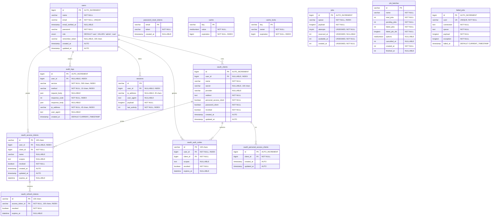

```mermaid
erDiagram
    %% Entidades principales
    users ||--o{ oauth_clients : "crea"
    users ||--o{ oauth_access_tokens : "posee"
    users ||--o{ oauth_auth_codes : "genera"
    users ||--o{ audit_logs : "realiza"
    users ||--o{ sessions : "tiene"
    
    oauth_clients ||--o{ oauth_access_tokens : "emite"
    oauth_clients ||--o{ oauth_auth_codes : "autoriza"
    oauth_clients ||--o{ oauth_personal_access_clients : "es"
    
    oauth_access_tokens ||--o{ oauth_refresh_tokens : "renueva"

    %% Tabla: users
    users {
        bigint id PK "AUTO_INCREMENT"
        varchar name "NOT NULL"
        varchar email UK "NOT NULL, UNIQUE"
        timestamp email_verified_at "NULLABLE"
        varchar password "NOT NULL"
        enum role "DEFAULT 'user', VALUES: 'admin', 'user'"
        varchar remember_token "NULLABLE, 100 chars"
        timestamp created_at "AUTO"
        timestamp updated_at "AUTO"
    }

    %% Tabla: audit_logs
    audit_logs {
        bigint id PK "AUTO_INCREMENT"
        bigint user_id FK "NULLABLE, INDEX"
        varchar service "NOT NULL, 500 chars, INDEX"
        varchar method "NOT NULL, 10 chars, INDEX"
        json request_body "NULLABLE"
        int response_code "NOT NULL, INDEX"
        json response_body "NULLABLE"
        varchar ip_address "NOT NULL, 45 chars, INDEX"
        text user_agent "NULLABLE"
        timestamp created_at "DEFAULT CURRENT_TIMESTAMP"
    }

    %% Tabla: oauth_clients
    oauth_clients {
        bigint id PK "AUTO_INCREMENT"
        bigint user_id FK "NULLABLE, INDEX"
        varchar name "NOT NULL"
        varchar secret "NULLABLE, 100 chars"
        varchar provider "NULLABLE"
        text redirect "NOT NULL"
        boolean personal_access_client "NOT NULL"
        boolean password_client "NOT NULL"
        boolean revoked "NOT NULL"
        timestamp created_at "AUTO"
        timestamp updated_at "AUTO"
    }

    %% Tabla: oauth_access_tokens
    oauth_access_tokens {
        varchar id PK "100 chars"
        bigint user_id FK "NULLABLE, INDEX"
        bigint client_id FK "NOT NULL"
        varchar name "NULLABLE"
        text scopes "NULLABLE"
        boolean revoked "NOT NULL"
        timestamp created_at "AUTO"
        timestamp updated_at "AUTO"
        datetime expires_at "NULLABLE"
    }

    %% Tabla: oauth_refresh_tokens
    oauth_refresh_tokens {
        varchar id PK "100 chars"
        varchar access_token_id FK "NOT NULL, 100 chars, INDEX"
        boolean revoked "NOT NULL"
        datetime expires_at "NULLABLE"
    }

    %% Tabla: oauth_auth_codes
    oauth_auth_codes {
        varchar id PK "100 chars"
        bigint user_id FK "NOT NULL, INDEX"
        bigint client_id FK "NOT NULL"
        text scopes "NULLABLE"
        boolean revoked "NOT NULL"
        datetime expires_at "NULLABLE"
    }

    %% Tabla: oauth_personal_access_clients
    oauth_personal_access_clients {
        bigint id PK "AUTO_INCREMENT"
        bigint client_id FK "NOT NULL"
        timestamp created_at "AUTO"
        timestamp updated_at "AUTO"
    }

    %% Tabla: sessions
    sessions {
        varchar id PK
        bigint user_id FK "NULLABLE, INDEX"
        varchar ip_address "NULLABLE, 45 chars"
        text user_agent "NULLABLE"
        longtext payload "NOT NULL"
        int last_activity "NOT NULL, INDEX"
    }

    %% Tabla: password_reset_tokens
    password_reset_tokens {
        varchar email PK
        varchar token "NOT NULL"
        timestamp created_at "NULLABLE"
    }

    %% Tabla: cache
    cache {
        varchar key PK
        mediumtext value "NOT NULL"
        bigint expiration "NOT NULL, INDEX"
    }

    %% Tabla: cache_locks
    cache_locks {
        varchar key PK
        varchar owner "NOT NULL"
        bigint expiration "NOT NULL, INDEX"
    }

    %% Tabla: jobs
    jobs {
        bigint id PK "AUTO_INCREMENT"
        varchar queue "NOT NULL, INDEX"
        longtext payload "NOT NULL"
        tinyint attempts "UNSIGNED, NOT NULL"
        int reserved_at "UNSIGNED, NULLABLE"
        int available_at "UNSIGNED, NOT NULL"
        int created_at "UNSIGNED, NOT NULL"
    }

    %% Tabla: job_batches
    job_batches {
        varchar id PK
        varchar name "NOT NULL"
        int total_jobs "NOT NULL"
        int pending_jobs "NOT NULL"
        int failed_jobs "NOT NULL"
        longtext failed_job_ids "NOT NULL"
        mediumtext options "NULLABLE"
        int cancelled_at "NULLABLE"
        int created_at "NOT NULL"
        int finished_at "NULLABLE"
    }

    %% Tabla: failed_jobs
    failed_jobs {
        bigint id PK "AUTO_INCREMENT"
        varchar uuid UK "UNIQUE, NOT NULL"
        text connection "NOT NULL"
        text queue "NOT NULL"
        longtext payload "NOT NULL"
        longtext exception "NOT NULL"
        timestamp failed_at "DEFAULT CURRENT_TIMESTAMP"
    }
```