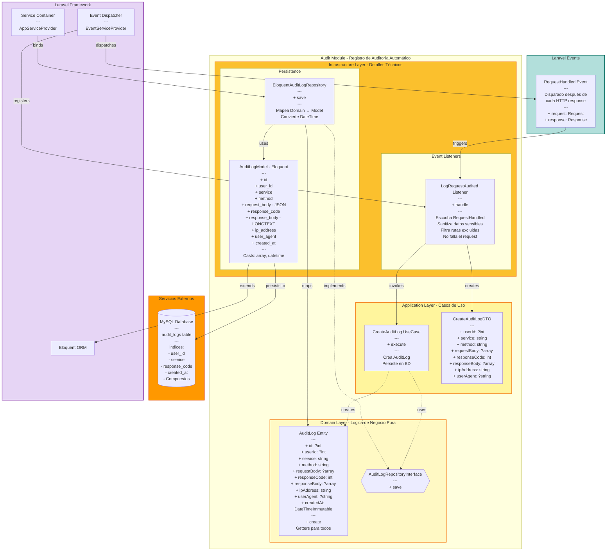

# Audit Module - Diagrama de Componentes



## 📊 Descripción del Módulo Audit

### Responsabilidades

- ✅ Registro automático de todas las peticiones HTTP
- ✅ Captura completa de request y response
- ✅ Sanitización de datos sensibles (passwords, tokens)
- ✅ Tracking de usuario y metadata
- ✅ Indexación para consultas rápidas
- ✅ No interrumpe el flujo normal (fail silently)

### 🎯 Domain Layer (Núcleo del Negocio)

**Entidades:**
- `AuditLog` - Registro inmutable de una petición HTTP
  - Todos los campos readonly
  - Usa `DateTimeImmutable` para timestamps
  - Factory method `create()` para construcción

**Interfaces (Puertos):**
- `AuditLogRepositoryInterface` - Contrato de persistencia
  - Solo necesita `save()` (YAGNI aplicado)

**Reglas de Negocio:**
- Registros inmutables (no se pueden editar)
- User ID puede ser null (requests no autenticados)
- Request/Response body pueden ser null (requests vacíos)
- Timestamps automáticos

### 🔄 Application Layer (Casos de Uso)

**Use Cases:**
1. `CreateAuditLog` - Crea y persiste audit log
   - Construye entidad `AuditLog`
   - Invoca repositorio
   - Retorna entidad guardada

**DTOs:**
- `CreateAuditLogDTO` - Datos de auditoría
  - Todos los campos readonly
  - Acepta null en campos opcionales

**Flujo de Auditoría:**
```
1. HTTP Request ejecutado
2. Laravel dispara RequestHandled event
3. LogRequestAudited listener escucha
4. Listener filtra rutas excluidas
5. Listener sanitiza datos sensibles
6. Listener crea DTO
7. Use Case crea AuditLog entity
8. Repository persiste en BD
9. Si falla, solo logea error (no interrumpe)
```

### 🔌 Infrastructure Layer (Adaptadores)

**Event Listeners:**
- `LogRequestAudited` - Escucha `RequestHandled` de Laravel
  - **Rutas Excluidas**:
    - `api/v1/health` - Health checks
    - `_debugbar` - Laravel Debugbar
    - `telescope` - Laravel Telescope
  
  - **Sanitización**:
    - `password` → `***REDACTED***`
    - `password_confirmation` → `***REDACTED***`
    - `token` → `***REDACTED***`
    - `api_key` → `***REDACTED***`
  
  - **Error Handling**:
    - Try-catch completo
    - Logea errores pero no falla
    - No interrumpe el request original

**Repositorios (Adapters):**
- `EloquentAuditLogRepository` - Implementación con Eloquent
  - Mapea `AuditLog` (Domain) ↔ `AuditLogModel` (Eloquent)
  - Convierte `DateTimeImmutable` ↔ Carbon
  - Maneja arrays como JSON automáticamente

**Models:**
- `AuditLogModel` - Modelo Eloquent
  - `$timestamps = false` - Solo usa `created_at` manual
  - **Casts**:
    - `request_body` → array (JSON)
    - `response_body` → array (JSON)
    - `created_at` → datetime

### 🗄️ Estructura de Base de Datos

**Tabla: `audit_logs`**

| Columna | Tipo | Índice | Descripción |
|---------|------|--------|-------------|
| id | BIGINT | PK | ID autoincremental |
| user_id | BIGINT | ✅ | ID del usuario (nullable) |
| service | VARCHAR(500) | ✅ | Ruta del endpoint |
| method | VARCHAR(10) | ✅ | HTTP method (GET, POST, etc) |
| request_body | JSON | - | Body del request (nullable) |
| response_code | INT | ✅ | HTTP status code |
| response_body | LONGTEXT | - | Body del response (JSON) |
| ip_address | VARCHAR(45) | ✅ | IP del cliente |
| user_agent | TEXT | - | User agent (nullable) |
| created_at | TIMESTAMP | - | Timestamp del registro |

**Índices Compuestos:**
- `(user_id, created_at)` - Queries por usuario
- `(response_code, created_at)` - Queries por error

**Nota**: `response_body` es `LONGTEXT` para soportar responses grandes (>5000 chars) sin truncamiento.

### 📡 Event-Driven Architecture

**Laravel Event Flow:**
```
HTTP Request
    ↓
Controller procesa
    ↓
Response generada
    ↓
Laravel dispara RequestHandled
    ↓
LogRequestAudited::handle()
    ↓
CreateAuditLog::execute()
    ↓
EloquentAuditLogRepository::save()
    ↓
MySQL INSERT
```

**Ventajas:**
- ✅ Completamente desacoplado
- ✅ No modifica controllers
- ✅ Fácil de activar/desactivar
- ✅ No impacta performance (async posible)

### 🔐 Seguridad y Privacidad

**Datos Sanitizados:**
```php
Request:
{
  "email": "user@example.com",
  "password": "***REDACTED***"  // ← Sanitizado
}
```

**Datos NO Sanitizados:**
- Email (necesario para debugging)
- Query parameters
- Response bodies (excepto si contienen tokens)
- Headers (excepto Authorization)

### 📊 Casos de Uso

**1. Debugging de Errores:**
```sql
SELECT * FROM audit_logs 
WHERE response_code >= 500 
ORDER BY created_at DESC 
LIMIT 10;
```

**2. Tracking de Usuario:**
```sql
SELECT * FROM audit_logs 
WHERE user_id = 123 
ORDER BY created_at DESC;
```

**3. Análisis de Tráfico:**
```sql
SELECT service, COUNT(*) as requests 
FROM audit_logs 
WHERE created_at >= NOW() - INTERVAL 1 DAY 
GROUP BY service 
ORDER BY requests DESC;
```

**4. Detección de Intentos de Acceso:**
```sql
SELECT ip_address, COUNT(*) as attempts 
FROM audit_logs 
WHERE service = 'api/v1/login' 
AND response_code = 401 
AND created_at >= NOW() - INTERVAL 1 HOUR 
GROUP BY ip_address 
HAVING attempts > 5;
```

### 🧪 Testing

**Tests E2E Cubren:**
- ✅ Captura completa de request/response (>5000 chars)
- ✅ Sanitización de passwords y tokens
- ✅ Tracking de user journey (múltiples requests)
- ✅ Exclusión de health endpoint
- ✅ Orden cronológico de logs
- ✅ IP address consistente

### ⚡ Performance

**Optimizaciones:**
- ✅ Índices en campos frecuentemente consultados
- ✅ `created_at` indexado para queries temporales
- ✅ Índices compuestos para queries comunes
- ✅ Sin relaciones Eloquent (simple inserts)

**Consideraciones Futuras:**
- Mover a queue asíncrona para no bloquear response
- Implementar rotation de logs (particionado por fecha)
- Comprimir responses muy grandes

### 🔄 Extensibilidad

**Para agregar nuevo listener:**
```php
// AuditServiceProvider
Event::listen(
    RequestHandled::class,
    [LogRequestAudited::class, 'handle']
);
```

**Para cambiar storage (ej: MongoDB, Elasticsearch):**
1. Crear nuevo repositorio implementando `AuditLogRepositoryInterface`
2. Registrar en `AppServiceProvider`
3. No tocar Domain ni Application

### 📝 Principios Aplicados

✅ **Event-Driven** - Desacoplado vía eventos  
✅ **Fail Silently** - No interrumpe requests  
✅ **Data Sanitization** - Protege información sensible  
✅ **Immutability** - Registros no modificables  
✅ **YAGNI** - Solo métodos necesarios  
✅ **Single Responsibility** - Cada clase una responsabilidad  

### 🚨 Notas Importantes

⚠️ **No usar para:**
- Logs de aplicación (usar Laravel Log facade)
- Eventos de negocio (crear módulo específico)
- Métricas de performance (usar APM tool)

✅ **Ideal para:**
- Compliance y auditoría
- Debugging de producción
- Análisis de tráfico
- Detección de anomalías
- Tracking de usuarios

---

**Última actualización**: 2026-03-20
