# Auth Module - Diagrama de Componentes

```mermaid
graph TB
    subgraph authModule[Auth Module - Autenticación y Autorización]
        subgraph domain[Domain Layer - Lógica de Negocio Pura]
            User[User Entity<br/>---<br/>+ id: int<br/>+ name: string<br/>+ email: Email<br/>+ password: Password<br/>+ role: Role<br/>+ createdAt: DateTime<br/>---<br/>+ verifyPassword<br/>+ changeRole<br/>+ isAdmin<br/>+ ensureIsAdmin]
            
            Email[Email VO<br/>---<br/>+ value: string<br/>---<br/>+ validate]
            
            Password[Password VO<br/>---<br/>+ hash: string<br/>---<br/>+ verify<br/>+ hash]
            
            Role[Role Enum<br/>---<br/>ADMIN<br/>USER<br/>---<br/>+ isAdmin<br/>+ isUser]
            
            UserRepoIF{{UserRepositoryInterface<br/>---<br/>+ save<br/>+ findByEmail<br/>+ findById<br/>+ existsByEmail}}
            
            TokenServiceIF{{TokenServiceInterface<br/>---<br/>+ generateToken}}
        end
        
        subgraph application[Application Layer - Casos de Uso]
            RegisterUser[RegisterUser UseCase<br/>---<br/>+ execute]
            LoginUser[LoginUser UseCase<br/>---<br/>+ execute]
            LogoutUser[LogoutUser UseCase<br/>---<br/>+ execute]
            CreateAdminUser[CreateAdminUser UseCase<br/>---<br/>+ execute]
            
            RegisterUserDTO[RegisterUserDTO<br/>---<br/>+ name: string<br/>+ email: string<br/>+ password: string]
            
            LoginDTO[LoginDTO<br/>---<br/>+ email: string<br/>+ password: string]
        end
        
        subgraph infrastructure[Infrastructure Layer - Detalles Técnicos]
            subgraph controllers[HTTP Controllers]
                PostRegisterCtrl[PostRegisterUserController<br/>Single Action<br/>---<br/>+ __invoke]
                PostLoginCtrl[PostLoginUserController<br/>Single Action<br/>---<br/>+ __invoke]
                PostLogoutCtrl[PostLogoutUserController<br/>Single Action<br/>---<br/>+ __invoke]
                GetUserCtrl[GetAuthenticatedUserController<br/>Single Action<br/>---<br/>+ __invoke]
            end
            
            subgraph persistence[Persistence]
                EloquentRepo[EloquentUserRepository<br/>---<br/>+ save<br/>+ findByEmail<br/>+ findById<br/>+ existsByEmail<br/>---<br/>Adapta Domain ↔ Infrastructure]
                
                UserModel[UserModel - Eloquent<br/>---<br/>+ id<br/>+ name<br/>+ email<br/>+ password<br/>+ role<br/>+ timestamps<br/>---<br/>+ createToken - Passport]
            end
            
            subgraph services[Services]
                PassportToken[PassportTokenService<br/>---<br/>+ generateToken<br/>---<br/>Usa Laravel Passport]
            end
            
            subgraph middleware[Middleware]
                AdminMiddleware[EnsureUserIsAdmin<br/>---<br/>+ handle<br/>---<br/>Verifica role = ADMIN]
            end
            
            subgraph commands[Artisan Commands]
                CreateAdminCmd[CreateAdminCommand<br/>---<br/>+ handle<br/>---<br/>php artisan create:admin]
            end
        end
    end
    
    subgraph external[Servicios Externos]
        LaravelPassport[Laravel Passport<br/>OAuth2 Server]
        LaravelEloquent[Laravel Eloquent ORM]
        MySQL[(MySQL Database<br/>users table)]
    end
    
    subgraph framework[Laravel Framework]
        Router[Router<br/>---<br/>routes/api.php]
        Container[Service Container<br/>---<br/>AppServiceProvider]
    end
    
    %% Domain relationships
    User -->|has| Email
    User -->|has| Password
    User -->|has| Role
    
    %% Application -> Domain dependencies
    RegisterUser -.->|uses| UserRepoIF
    LoginUser -.->|uses| UserRepoIF
    LoginUser -.->|uses| TokenServiceIF
    LogoutUser -.->|uses| UserRepoIF
    CreateAdminUser -.->|uses| UserRepoIF
    
    RegisterUser -.->|creates| User
    LoginUser -.->|validates| User
    
    %% Infrastructure -> Application dependencies
    PostRegisterCtrl -->|invokes| RegisterUser
    PostLoginCtrl -->|invokes| LoginUser
    PostLogoutCtrl -->|invokes| LogoutUser
    GetUserCtrl -->|uses| UserRepoIF
    CreateAdminCmd -->|invokes| CreateAdminUser
    
    %% Infrastructure implements Domain interfaces
    EloquentRepo -.->|implements| UserRepoIF
    PassportToken -.->|implements| TokenServiceIF
    
    %% Infrastructure persistence
    EloquentRepo -->|uses| UserModel
    EloquentRepo -->|maps| User
    UserModel -->|extends| LaravelEloquent
    UserModel -->|persists to| MySQL
    
    %% Services integration
    PassportToken -->|uses| LaravelPassport
    UserModel -->|uses| LaravelPassport
    
    %% Framework bindings
    Router -->|routes to| PostRegisterCtrl
    Router -->|routes to| PostLoginCtrl
    Router -->|routes to| PostLogoutCtrl
    Router -->|routes to| GetUserCtrl
    Router -->|protects with| AdminMiddleware
    
    Container -->|binds| EloquentRepo
    Container -->|binds| PassportToken
    
    %% Styling
    classDef domainClass fill:#f0f0f0,stroke:#333,stroke-width:2px
    classDef appClass fill:#d3d3d3,stroke:#333,stroke-width:2px
    classDef infraClass fill:#808080,stroke:#333,stroke-width:2px,color:#fff
    classDef externalClass fill:#ffa500,stroke:#333,stroke-width:2px
    classDef frameworkClass fill:#e6d5f5,stroke:#333,stroke-width:2px
    
    class domain domainClass
    class application appClass
    class infrastructure infraClass
    class external externalClass
    class framework frameworkClass
```



## 📊 Descripción del Módulo Auth

### Responsabilidades

- ✅ Registro de usuarios
- ✅ Autenticación con OAuth2 (Laravel Passport)
- ✅ Autorización basada en roles (ADMIN, USER)
- ✅ Gestión de tokens de acceso
- ✅ Protección de endpoints con middleware
- ✅ Creación de administradores vía Artisan

### 🎯 Domain Layer (Núcleo del Negocio)

**Entidades:**
- `User` - Entidad principal con lógica de negocio (Tell Don't Ask)

**Value Objects:**
- `Email` - Validación de email
- `Password` - Hashing y verificación
- `Role` - Enum con ADMIN y USER

**Interfaces (Puertos):**
- `UserRepositoryInterface` - Contrato de persistencia
- `TokenServiceInterface` - Contrato de generación de tokens

**Reglas de Negocio:**
- Solo administradores pueden registrar usuarios
- Passwords deben ser hasheados
- Emails deben ser únicos
- Role por defecto es USER

### 🔄 Application Layer (Casos de Uso)

**Use Cases:**
1. `RegisterUser` - Registra un nuevo usuario (solo admin)
2. `LoginUser` - Autentica y genera token
3. `LogoutUser` - Revoca token actual
4. `CreateAdminUser` - Crea administrador (vía CLI)

**DTOs:**
- `RegisterUserDTO` - Datos de registro
- `LoginDTO` - Credenciales de login

**Flujo típico:**
```
Controller → Use Case → Repository Interface → Domain Entity
```

### 🔌 Infrastructure Layer (Adaptadores)

**HTTP Controllers (Single Action):**
- `PostRegisterUserController` - POST /api/v1/register
- `PostLoginUserController` - POST /api/v1/login
- `PostLogoutUserController` - POST /api/v1/logout
- `GetAuthenticatedUserController` - GET /api/v1/user

**Repositorios (Adapters):**
- `EloquentUserRepository` - Implementación con Eloquent
  - Mapea entre `User` (Domain) y `UserModel` (Eloquent)

**Servicios:**
- `PassportTokenService` - Generación de tokens OAuth2

**Middleware:**
- `EnsureUserIsAdmin` - Verifica role = ADMIN

**Comandos:**
- `CreateAdminCommand` - `php artisan create:admin`

### 🔐 Seguridad

- ✅ Passwords hasheados con bcrypt
- ✅ Tokens OAuth2 con Laravel Passport
- ✅ Middleware de autorización
- ✅ Validación en múltiples capas

### 📍 Endpoints

| Método | Ruta | Auth | Middleware |
|--------|------|------|------------|
| POST | /api/v1/login | No | - |
| POST | /api/v1/register | Sí | auth:api, admin |
| POST | /api/v1/logout | Sí | auth:api |
| GET | /api/v1/user | Sí | auth:api |

### 🔗 Dependencias Externas

- **Laravel Passport** - OAuth2 Server
- **Laravel Eloquent** - ORM
- **MySQL** - Base de datos (tabla `users`)

### 📝 Principios Aplicados

✅ **Single Responsibility** - Cada clase tiene una responsabilidad  
✅ **Dependency Inversion** - Domain no depende de Infrastructure  
✅ **Tell Don't Ask** - Entidades con métodos de negocio  
✅ **Ports & Adapters** - Interfaces + Implementaciones  
✅ **Single Action Controllers** - Un controller = una acción  

---

**Última actualización**: 2026-03-20
