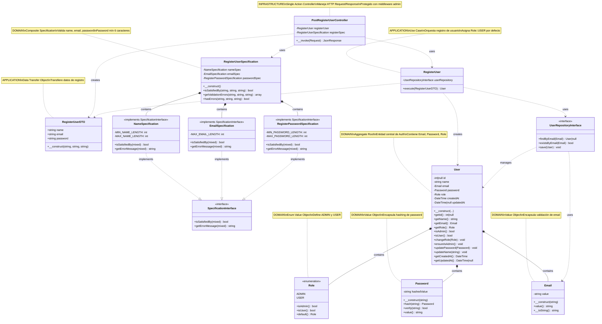

```mermaid
classDiagram
    %% ============================================
    %% INFRASTRUCTURE LAYER (Controller)
    %% ============================================
    class PostRegisterUserController {
        -RegisterUser registerUser
        -RegisterUserSpecification registerSpec
        +__invoke(Request) JsonResponse
    }

    %% ============================================
    %% APPLICATION LAYER
    %% ============================================
    class RegisterUser {
        -UserRepositoryInterface userRepository
        +execute(RegisterUserDTO) User
    }

    class RegisterUserDTO {
        +string name
        +string email
        +string password
        +__construct(string, string, string)
    }

    %% ============================================
    %% DOMAIN LAYER - Specifications
    %% ============================================
    class RegisterUserSpecification {
        -NameSpecification nameSpec
        -EmailSpecification emailSpec
        -RegisterPasswordSpecification passwordSpec
        +__construct()
        +isSatisfiedBy(string, string, string) bool
        +getValidationErrors(string, string, string) array
        +hasErrors(string, string, string) bool
    }

    class NameSpecification {
        <<implements SpecificationInterface>>
        -MIN_NAME_LENGTH: int
        -MAX_NAME_LENGTH: int
        +isSatisfiedBy(mixed) bool
        +getErrorMessage(mixed) string
    }

    class EmailSpecification {
        <<implements SpecificationInterface>>
        -MAX_EMAIL_LENGTH: int
        +isSatisfiedBy(mixed) bool
        +getErrorMessage(mixed) string
    }

    class RegisterPasswordSpecification {
        <<implements SpecificationInterface>>
        -MIN_PASSWORD_LENGTH: int
        -MAX_PASSWORD_LENGTH: int
        +isSatisfiedBy(mixed) bool
        +getErrorMessage(mixed) string
    }

    class SpecificationInterface {
        <<interface>>
        +isSatisfiedBy(mixed) bool
        +getErrorMessage(mixed) string
    }

    %% ============================================
    %% DOMAIN LAYER - Repository
    %% ============================================
    class UserRepositoryInterface {
        <<interface>>
        +findByEmail(Email) User|null
        +existsByEmail(Email) bool
        +save(User) void
    }

    %% ============================================
    %% DOMAIN LAYER - Entity
    %% ============================================
    class User {
        -int|null id
        -string name
        -Email email
        -Password password
        -Role role
        -DateTime createdAt
        -DateTime|null updatedAt
        +__construct(...)
        +getId() int|null
        +getName() string
        +getEmail() Email
        +getRole() Role
        +isAdmin() bool
        +isUser() bool
        +changeRole(Role) void
        +ensureIsAdmin() void
        +updatePassword(Password) void
        +updateName(string) void
        +getCreatedAt() DateTime
        +getUpdatedAt() DateTime|null
    }

    %% ============================================
    %% DOMAIN LAYER - Value Objects
    %% ============================================
    class Email {
        -string value
        +__construct(string)
        +value() string
        +__toString() string
    }

    class Password {
        -string hashedValue
        +__construct(string)
        +hash(string) Password
        +verify(string) bool
        +value() string
    }

    class Role {
        <<enumeration>>
        ADMIN
        USER
        +isAdmin() bool
        +isUser() bool
        +default() Role
    }

    %% ============================================
    %% RELATIONSHIPS
    %% ============================================
    
    %% Controller dependencies
    PostRegisterUserController ..> RegisterUser : uses
    PostRegisterUserController ..> RegisterUserSpecification : uses
    PostRegisterUserController ..> RegisterUserDTO : creates

    %% Use Case dependencies
    RegisterUser ..> UserRepositoryInterface : uses
    RegisterUser ..> RegisterUserDTO : receives
    RegisterUser ..> User : creates

    %% Composite Specification
    RegisterUserSpecification *-- NameSpecification : contains
    RegisterUserSpecification *-- EmailSpecification : contains
    RegisterUserSpecification *-- RegisterPasswordSpecification : contains

    %% Specifications implement interface
    NameSpecification ..|> SpecificationInterface : implements
    EmailSpecification ..|> SpecificationInterface : implements
    RegisterPasswordSpecification ..|> SpecificationInterface : implements

    %% Entity composition
    User *-- Email : contains
    User *-- Password : contains
    User *-- Role : contains

    %% Repository manages Entity
    UserRepositoryInterface ..> User : manages
    UserRepositoryInterface ..> Email : uses

    %% Notas sobre capas
    note for PostRegisterUserController "INFRASTRUCTURE\nSingle Action Controller\nManeja HTTP Request/Response\nProtegido con middleware admin"
    
    note for RegisterUser "APPLICATION\nUse Case\nOrquesta registro de usuario\nAsigna Role::USER por defecto"
    
    note for RegisterUserDTO "APPLICATION\nData Transfer Object\nTransfiere datos de registro"
    
    note for RegisterUserSpecification "DOMAIN\nComposite Specification\nValida name, email, password\nPassword mín 6 caracteres"
    
    note for User "DOMAIN\nAggregate Root\nEntidad central de Auth\nContiene Email, Password, Role"
    
    note for Email "DOMAIN\nValue Object\nEncapsula validación de email"
    
    note for Password "DOMAIN\nValue Object\nEncapsula hashing de password"
    
    note for Role "DOMAIN\nEnum Value Object\nDefine ADMIN y USER"
```