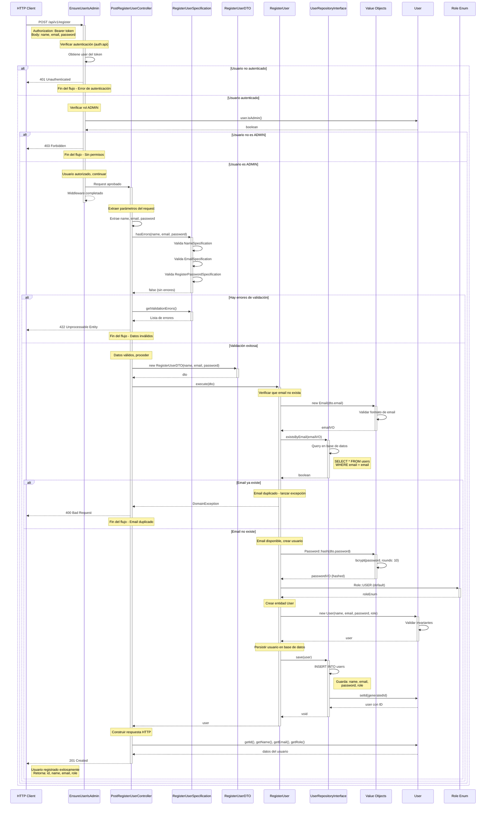

```mermaid
sequenceDiagram
    participant Client as HTTP Client
    participant Middleware as EnsureUserIsAdmin
    participant Controller as PostRegisterUserController
    participant Spec as RegisterUserSpecification
    participant DTO as RegisterUserDTO
    participant UseCase as RegisterUser
    participant Repo as UserRepositoryInterface
    participant VOs as Value Objects
    participant Entity as User
    participant Role as Role Enum

    %% === AUTENTICACIÓN ===
    Client->>+Middleware: POST /api/v1/register
    Note right of Client: Authorization: Bearer token<br/>Body: name, email, password
    
    Note over Middleware: Verificar autenticación (auth:api)
    Middleware->>Middleware: Obtiene user del token
    
    alt Usuario no autenticado
        Middleware-->>Client: 401 Unauthenticated
        Note over Middleware: Fin del flujo - Error de autenticación
    else Usuario autenticado
        Note over Middleware: Verificar rol ADMIN
        Middleware->>Entity: user.isAdmin()
        Entity-->>Middleware: boolean
        
        alt Usuario no es ADMIN
            Middleware-->>Client: 403 Forbidden
            Note over Middleware: Fin del flujo - Sin permisos
        else Usuario es ADMIN
            Note over Middleware: Usuario autorizado, continuar
            Middleware->>+Controller: Request aprobado
            Middleware-->>-Middleware: Middleware completado
            
            %% === VALIDACIÓN ===
            Note over Controller: Extraer parámetros del request
            Controller->>Controller: Extrae name, email, password
            
            Controller->>+Spec: hasErrors(name, email, password)
            Spec->>Spec: Valida NameSpecification
            Spec->>Spec: Valida EmailSpecification
            Spec->>Spec: Valida RegisterPasswordSpecification
            Spec-->>-Controller: false (sin errores)
            
            alt Hay errores de validación
                Controller->>+Spec: getValidationErrors()
                Spec-->>-Controller: Lista de errores
                Controller-->>Client: 422 Unprocessable Entity
                Note over Controller: Fin del flujo - Datos inválidos
            else Validación exitosa
                Note over Controller: Datos válidos, proceder
                
                %% === CREACIÓN DE DTO ===
                Controller->>+DTO: new RegisterUserDTO(name, email, password)
                DTO-->>-Controller: dto
                
                %% === CASO DE USO ===
                Controller->>+UseCase: execute(dto)
                
                Note over UseCase: Verificar que email no exista
                UseCase->>+VOs: new Email(dto.email)
                VOs->>VOs: Validar formato de email
                VOs-->>-UseCase: emailVO
                
                UseCase->>+Repo: existsByEmail(emailVO)
                Repo->>Repo: Query en base de datos
                Note right of Repo: SELECT * FROM users<br/>WHERE email = email
                Repo-->>-UseCase: boolean
                
                alt Email ya existe
                    Note over UseCase: Email duplicado - lanzar excepción
                    UseCase-->>Controller: DomainException
                    Controller-->>Client: 400 Bad Request
                    Note over Controller: Fin del flujo - Email duplicado
                else Email no existe
                    Note over UseCase: Email disponible, crear usuario
                    
                    %% === CREACIÓN DE VALUE OBJECTS ===
                    UseCase->>+VOs: Password::hash(dto.password)
                    VOs->>VOs: bcrypt(password, rounds: 10)
                    VOs-->>-UseCase: passwordVO (hashed)
                    
                    UseCase->>+Role: Role::USER (default)
                    Role-->>-UseCase: roleEnum
                    
                    %% === CREACIÓN DE ENTIDAD ===
                    Note over UseCase: Crear entidad User
                    UseCase->>+Entity: new User(name, email, password, role)
                    Entity->>Entity: Validar invariantes
                    Entity-->>-UseCase: user
                    
                    %% === PERSISTENCIA ===
                    Note over UseCase: Persistir usuario en base de datos
                    UseCase->>+Repo: save(user)
                    Repo->>Repo: INSERT INTO users
                    Note right of Repo: Guarda: name, email,<br/>password, role
                    Repo->>Entity: setId(generatedId)
                    Entity-->>Repo: user con ID
                    Repo-->>-UseCase: void
                    
                    UseCase-->>-Controller: user
                    
                    %% === RESPUESTA ===
                    Note over Controller: Construir respuesta HTTP
                    Controller->>Entity: getId(), getName(), getEmail(), getRole()
                    Entity-->>Controller: datos del usuario
                    
                    Controller-->>-Client: 201 Created
                    Note right of Client: Usuario registrado exitosamente<br/>Retorna: id, name, email, role
                end
            end
        end
    end
```