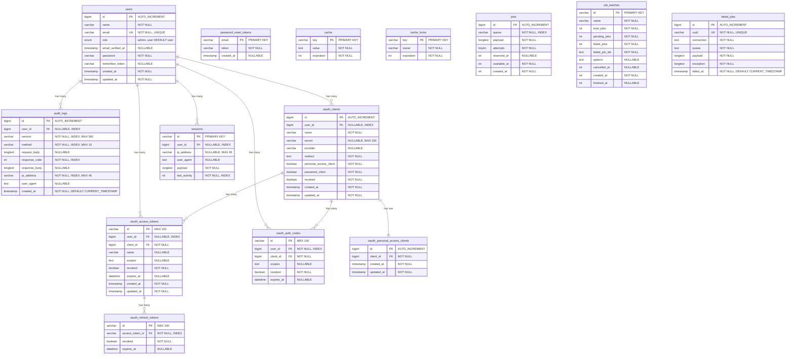

```mermaid
erDiagram
    %% ============================================
    %% TABLAS PRINCIPALES
    %% ============================================
    
    users {
        bigint id PK "AUTO_INCREMENT"
        varchar name "NOT NULL"
        varchar email UK "NOT NULL, UNIQUE"
        enum role "admin, user DEFAULT user"
        timestamp email_verified_at "NULLABLE"
        varchar password "NOT NULL"
        varchar remember_token "NULLABLE"
        timestamp created_at "NOT NULL"
        timestamp updated_at "NOT NULL"
    }
    
    audit_logs {
        bigint id PK "AUTO_INCREMENT"
        bigint user_id FK "NULLABLE, INDEX"
        varchar service "NOT NULL, INDEX, MAX 500"
        varchar method "NOT NULL, INDEX, MAX 10"
        longtext request_body "NULLABLE"
        int response_code "NOT NULL, INDEX"
        longtext response_body "NULLABLE"
        varchar ip_address "NOT NULL, INDEX, MAX 45"
        text user_agent "NULLABLE"
        timestamp created_at "NOT NULL, DEFAULT CURRENT_TIMESTAMP"
    }
    
    %% ============================================
    %% OAUTH 2.0 - LARAVEL PASSPORT
    %% ============================================
    
    oauth_clients {
        bigint id PK "AUTO_INCREMENT"
        bigint user_id FK "NULLABLE, INDEX"
        varchar name "NOT NULL"
        varchar secret "NULLABLE, MAX 100"
        varchar provider "NULLABLE"
        text redirect "NOT NULL"
        boolean personal_access_client "NOT NULL"
        boolean password_client "NOT NULL"
        boolean revoked "NOT NULL"
        timestamp created_at "NOT NULL"
        timestamp updated_at "NOT NULL"
    }
    
    oauth_access_tokens {
        varchar id PK "MAX 100"
        bigint user_id FK "NULLABLE, INDEX"
        bigint client_id FK "NOT NULL"
        varchar name "NULLABLE"
        text scopes "NULLABLE"
        boolean revoked "NOT NULL"
        datetime expires_at "NULLABLE"
        timestamp created_at "NOT NULL"
        timestamp updated_at "NOT NULL"
    }
    
    oauth_refresh_tokens {
        varchar id PK "MAX 100"
        varchar access_token_id FK "NOT NULL, INDEX"
        boolean revoked "NOT NULL"
        datetime expires_at "NULLABLE"
    }
    
    oauth_auth_codes {
        varchar id PK "MAX 100"
        bigint user_id FK "NOT NULL, INDEX"
        bigint client_id FK "NOT NULL"
        text scopes "NULLABLE"
        boolean revoked "NOT NULL"
        datetime expires_at "NULLABLE"
    }
    
    oauth_personal_access_clients {
        bigint id PK "AUTO_INCREMENT"
        bigint client_id FK "NOT NULL"
        timestamp created_at "NOT NULL"
        timestamp updated_at "NOT NULL"
    }
    
    %% ============================================
    %% TABLAS DEL SISTEMA (LARAVEL)
    %% ============================================
    
    password_reset_tokens {
        varchar email PK "PRIMARY KEY"
        varchar token "NOT NULL"
        timestamp created_at "NULLABLE"
    }
    
    sessions {
        varchar id PK "PRIMARY KEY"
        bigint user_id FK "NULLABLE, INDEX"
        varchar ip_address "NULLABLE, MAX 45"
        text user_agent "NULLABLE"
        longtext payload "NOT NULL"
        int last_activity "NOT NULL, INDEX"
    }
    
    cache {
        varchar key PK "PRIMARY KEY"
        text value "NOT NULL"
        int expiration "NOT NULL"
    }
    
    cache_locks {
        varchar key PK "PRIMARY KEY"
        varchar owner "NOT NULL"
        int expiration "NOT NULL"
    }
    
    jobs {
        bigint id PK "AUTO_INCREMENT"
        varchar queue "NOT NULL, INDEX"
        longtext payload "NOT NULL"
        tinyint attempts "NOT NULL"
        int reserved_at "NULLABLE"
        int available_at "NOT NULL"
        int created_at "NOT NULL"
    }
    
    job_batches {
        varchar id PK "PRIMARY KEY"
        varchar name "NOT NULL"
        int total_jobs "NOT NULL"
        int pending_jobs "NOT NULL"
        int failed_jobs "NOT NULL"
        text failed_job_ids "NOT NULL"
        text options "NULLABLE"
        int cancelled_at "NULLABLE"
        int created_at "NOT NULL"
        int finished_at "NULLABLE"
    }
    
    failed_jobs {
        bigint id PK "AUTO_INCREMENT"
        varchar uuid UK "NOT NULL, UNIQUE"
        text connection "NOT NULL"
        text queue "NOT NULL"
        longtext payload "NOT NULL"
        longtext exception "NOT NULL"
        timestamp failed_at "NOT NULL, DEFAULT CURRENT_TIMESTAMP"
    }
    
    %% ============================================
    %% RELACIONES
    %% ============================================
    
    %% Users relationships
    users ||--o{ audit_logs : "has many"
    users ||--o{ oauth_clients : "has many"
    users ||--o{ oauth_access_tokens : "has many"
    users ||--o{ oauth_auth_codes : "has many"
    users ||--o{ sessions : "has many"
    
    %% OAuth relationships
    oauth_clients ||--o{ oauth_access_tokens : "has many"
    oauth_clients ||--o{ oauth_auth_codes : "has many"
    oauth_clients ||--|| oauth_personal_access_clients : "has one"
    oauth_access_tokens ||--o{ oauth_refresh_tokens : "has many"
```