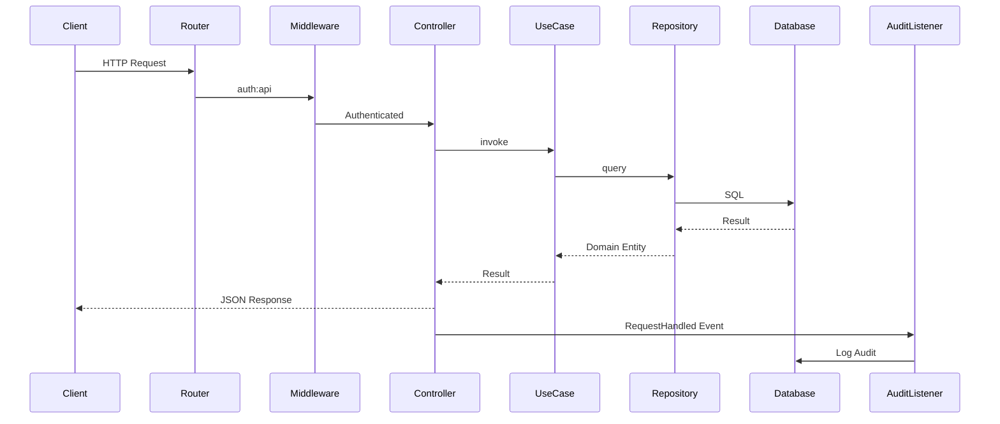

# 📊 Diagramas de Arquitectura - Índice

Documentación visual completa de la arquitectura del sistema API REST con arquitectura hexagonal.

---

## 🏗️ Vista General del Sistema

### [Diagrama de Componentes Completo (Mermaid)](../UML_Component_Diagram_Mermaid.md)
Vista general de los 4 módulos y sus relaciones. **Recomendado para empezar**.

### [Diagrama de Componentes Completo (PlantUML)](../UML_Component_Diagram.puml)
Versión PlantUML para exportar a PNG/SVG/PDF.

---

## 📦 Diagramas por Módulo

### 1. [Auth Module](./Auth_Module_Diagram.md) 🔐
**Autenticación y Autorización**

Cubre:
- Registro de usuarios (solo admin)
- Login con OAuth2 (Laravel Passport)
- Roles (ADMIN, USER)
- Middleware de autorización
- Gestión de tokens

**Endpoints**: `/login`, `/register`, `/logout`, `/user`

---

### 2. [Media Module](./Media_Module_Diagram.md) 🎬
**Búsqueda de Contenido Multimedia**

Cubre:
- Búsqueda de GIFs con paginación
- Obtención por ID
- Integración con GIPHY API
- Validación de parámetros
- Manejo de errores de API externa

**Endpoints**: `/media/search`, `/media/{id}`

**Diagramas de Secuencia Detallados:**
- [Media Search Sequence](./Media_Search_Sequence.md) 🔍 - Flujo completo de búsqueda
- [Media Get By ID Sequence](./Media_GetById_Sequence.md) 🎯 - Flujo de obtención por ID

---

### 3. [Audit Module](./Audit_Module_Diagram.md) 📝
**Registro de Auditoría Automático**

Cubre:
- Event-driven logging
- Captura de request/response
- Sanitización de datos sensibles
- Indexación para consultas
- Fail silently (no interrumpe)

**No tiene endpoints** - Funciona automáticamente vía eventos

---

### 4. [System Module](./System_Module_Diagram.md) ⚙️
**Información del Sistema**

Cubre:
- Health checks públicos
- Información de versión
- Estado del entorno
- Monitoring endpoint
- No requiere autenticación

**Endpoints**: `/health`

---

## 📋 Comparación Rápida

| Módulo | Endpoints | Auth | Dependencias Externas | Complejidad |
|--------|-----------|------|----------------------|-------------|
| **Auth** | 4 | Mixto | Laravel Passport, MySQL | Alta |
| **Media** | 2 | Sí | GIPHY API, Guzzle | Media |
| **Audit** | 0 | - | MySQL | Media |
| **System** | 1 | No | Config | Baja |

---

## 🎯 Arquitectura Hexagonal

Cada módulo sigue la misma estructura de 3 capas:

```
┌─────────────────────────────────────┐
│   Domain Layer (Blanco/Gris claro) │
│   ─────────────────────────────     │
│   • Entities                        │
│   • Value Objects                   │
│   • Interfaces (Puertos)            │
│   • Lógica de Negocio Pura          │
│   • Sin dependencias externas       │
└─────────────────────────────────────┘
            ↑ depende de
┌─────────────────────────────────────┐
│ Application Layer (Gris medio)      │
│ ──────────────────────────────      │
│ • Use Cases                         │
│ • DTOs                              │
│ • Orquestación                      │
│ • Depende solo de Domain            │
└─────────────────────────────────────┘
            ↑ depende de
┌─────────────────────────────────────┐
│ Infrastructure Layer (Gris oscuro)  │
│ ─────────────────────────────────── │
│ • Controllers                       │
│ • Repositories (Adaptadores)        │
│ • Services                          │
│ • Integraciones externas            │
│ • Frameworks (Laravel, Eloquent)    │
└─────────────────────────────────────┘
```

---

## 📚 Principios Aplicados

✅ **Dependency Inversion** - Domain no depende de nadie  
✅ **Ports & Adapters** - Interfaces en Domain, implementaciones en Infrastructure  
✅ **Separation of Concerns** - Cada capa tiene responsabilidades claras  
✅ **Bounded Contexts** - Módulos verticales independientes  
✅ **Single Responsibility** - Cada clase una responsabilidad  
✅ **Tell Don't Ask** - Entidades con comportamiento  
✅ **YAGNI** - Solo código necesario  
✅ **Single Action Controllers** - Un controller = una acción  

---

## 🔄 Flujo de una Petición Típica



---

## 🛠️ Herramientas de Visualización

### Opción 1: GitHub (Recomendado)
Simplemente abre cualquier archivo `.md` en GitHub. Los diagramas Mermaid se renderizan automáticamente.

### Opción 2: VS Code
1. Instala "Markdown Preview Enhanced"
2. Abre cualquier archivo `.md`
3. Click en el ícono de preview

### Opción 3: PlantUML (Para exportar)
Ver instrucciones en [`README_DIAGRAMS.md`](../README_DIAGRAMS.md)

---

## 📖 Documentación Adicional

- [API Endpoints](../../API_ENDPOINTS.md) - Lista completa de endpoints con ejemplos cURL
- [API Documentation](../../API_DOCUMENTATION.md) - Documentación detallada de la API
- [Cursor Rules](../../.cursorrules) - Reglas de arquitectura del proyecto

---

## 🔄 Actualizar Diagramas

Si modificas la arquitectura:

1. Edita el archivo `.md` correspondiente
2. Los diagramas Mermaid se actualizan automáticamente en GitHub
3. Para PlantUML, regenera la imagen siguiendo [`README_DIAGRAMS.md`](../README_DIAGRAMS.md)

---

## 📞 Convenciones

**Tipos de Relaciones:**
- Línea punteada (`-.->`) = Usa/Depende de (implementa interfaz)
- Línea sólida (`-->`) = Invoca/Llama directamente
- Interfaces con `{{dobles llaves}}`
- Value Objects marcados como "VO"
- DTOs son clases readonly

**Colores por Capa:**
- **Blanco/Gris claro** = Domain Layer
- **Gris medio** = Application Layer
- **Gris oscuro** = Infrastructure Layer
- **Naranja** = Servicios externos
- **Lavanda** = Framework Laravel

---

**Fecha de creación**: 2026-03-20  
**Versión**: 1.0.0  
**Módulos**: 4 (Auth, Media, Audit, System)  
**Tests E2E**: 14 (13 passing, 1 skipped)
