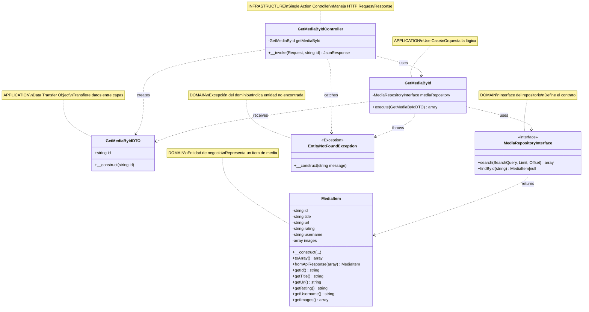

```mermaid
classDiagram
    %% ============================================
    %% INFRASTRUCTURE LAYER (Controller)
    %% ============================================
    class GetMediaByIdController {
        -GetMediaById getMediaById
        +__invoke(Request, string id) JsonResponse
    }

    %% ============================================
    %% APPLICATION LAYER
    %% ============================================
    class GetMediaById {
        -MediaRepositoryInterface mediaRepository
        +execute(GetMediaByIdDTO) array
    }

    class GetMediaByIdDTO {
        +string id
        +__construct(string id)
    }

    %% ============================================
    %% DOMAIN LAYER - Repositories
    %% ============================================
    class MediaRepositoryInterface {
        <<interface>>
        +search(SearchQuery, Limit, Offset) array
        +findById(string) MediaItem|null
    }

    %% ============================================
    %% DOMAIN LAYER - Entities
    %% ============================================
    class MediaItem {
        -string id
        -string title
        -string url
        -string rating
        -string username
        -array images
        +__construct(...)
        +toArray() array
        +fromApiResponse(array) MediaItem
        +getId() string
        +getTitle() string
        +getUrl() string
        +getRating() string
        +getUsername() string
        +getImages() array
    }

    %% ============================================
    %% DOMAIN LAYER - Exceptions
    %% ============================================
    class EntityNotFoundException {
        <<Exception>>
        +__construct(string message)
    }

    %% ============================================
    %% RELATIONSHIPS
    %% ============================================
    
    %% Controller usa Use Case
    GetMediaByIdController ..> GetMediaById : uses

    %% Controller crea DTO
    GetMediaByIdController ..> GetMediaByIdDTO : creates

    %% Controller captura Exception
    GetMediaByIdController ..> EntityNotFoundException : catches

    %% Use Case usa Repository Interface
    GetMediaById ..> MediaRepositoryInterface : uses

    %% Use Case recibe DTO
    GetMediaById ..> GetMediaByIdDTO : receives

    %% Use Case lanza Exception
    GetMediaById ..> EntityNotFoundException : throws

    %% Repository retorna Entity
    MediaRepositoryInterface ..> MediaItem : returns

    %% Notas sobre capas
    note for GetMediaByIdController "INFRASTRUCTURE\nSingle Action Controller\nManeja HTTP Request/Response"
    
    note for GetMediaById "APPLICATION\nUse Case\nOrquesta la lógica"
    
    note for GetMediaByIdDTO "APPLICATION\nData Transfer Object\nTransfiere datos entre capas"
    
    note for MediaRepositoryInterface "DOMAIN\nInterface del repositorio\nDefine el contrato"
    
    note for MediaItem "DOMAIN\nEntidad de negocio\nRepresenta un item de media"
    
    note for EntityNotFoundException "DOMAIN\nExcepción del dominio\nIndica entidad no encontrada"
```