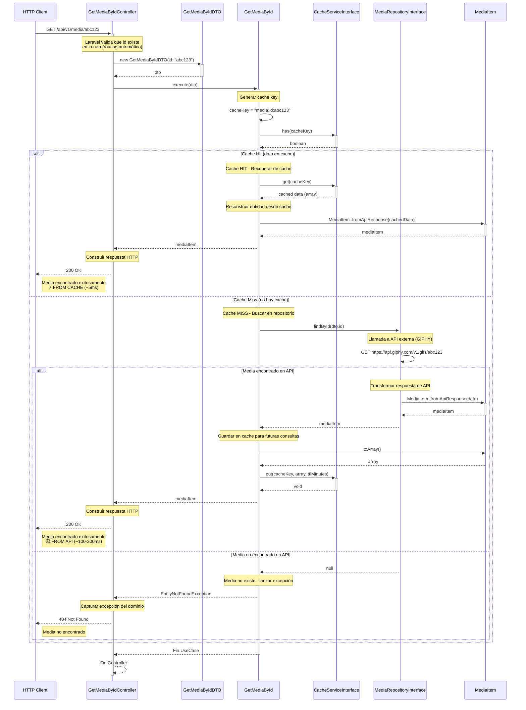

# Diagrama de Secuencia - Obtener Media por ID

Este diagrama muestra el flujo completo del caso de uso "Obtener Media por ID" con sistema de caché.

## Diagrama



## Descripción del Flujo

### 1. Recepción de Request (Controller)
- Cliente hace GET a `/api/v1/media/{id}`
- Laravel routing extrae `{id}` de la URL
- Controller recibe el `id` como parámetro del método `__invoke()`

### 2. Creación de DTO (Application)
- Controller crea `GetMediaByIdDTO` con el `id` recibido
- **No hay validación explícita**: Laravel garantiza que `id` existe si la ruta matcheó

### 3. Ejecución de Use Case con Cache (Application)
- Controller invoca `GetMediaById->execute(dto)`
- Use Case genera cache key: `media:id:{id}`
- **Verificar Cache**:
  - Llama a `Cache->has(cacheKey)` para verificar si existe
  
### 4. Flujos según estado del cache

#### Flujo A: Cache Hit ⚡ (dato en cache)
1. Use Case recupera datos desde Redis con `Cache->get(cacheKey)` (~5ms)
2. Reconstruye `MediaItem` desde array cacheado usando `MediaItem::fromApiResponse()`
3. Retorna inmediatamente al Controller
4. Controller responde `200 OK` con los datos
5. **Tiempo total**: ~5-10ms

#### Flujo B: Cache Miss ⏱️ (no hay cache)
1. Use Case invoca `MediaRepositoryInterface->findById(id)`
2. **Implementación concreta** (ej: `GiphyMediaRepository`):
   - Construye URL: `https://api.giphy.com/v1/gifs/{id}`
   - Hace request HTTP a GIPHY API (~100-300ms)
   - Recibe respuesta JSON

##### Sub-flujo B1: Media Encontrado ✅
1. Repository transforma respuesta usando `MediaItem::fromApiResponse(data)`
2. Retorna `MediaItem` al Use Case
3. **Use Case guarda en cache**:
   - Convierte `mediaItem->toArray()`
   - Almacena en Redis con TTL configurable
4. Use Case retorna `MediaItem` al Controller
5. Controller construye respuesta `200 OK`
6. **Tiempo total**: ~100-300ms (primera vez), luego ~5ms en cache

##### Sub-flujo B2: Media No Encontrado ❌
1. Repository recibe `404` de GIPHY (o response inválido)
2. Repository retorna `null`
3. Use Case detecta `null` y lanza `EntityNotFoundException`
4. Controller captura la excepción
5. Controller construye respuesta `404 Not Found`
6. **No se cachea** el resultado negativo

## Beneficios del Cache

### Performance
- **Primera llamada**: ~100-300ms (llamada a GIPHY API + guardado en cache)
- **Llamadas subsecuentes**: ~5ms (lectura de Redis)
- **Mejora**: 20-60x más rápido

### Reducción de Costos
- Menos llamadas a GIPHY API
- Menor latencia para usuarios
- Menor carga en servicios externos

### Configuración
- TTL configurable vía `.env` (`MEDIA_CACHE_TTL_MINUTES`)
- Cache puede deshabilitarse sin cambiar código (`MEDIA_CACHE_ENABLED=false`)
- Invalidación automática después del TTL

## Posibles Respuestas

### Éxito (200 OK)
```json
{
  "success": true,
  "message": "Media encontrado exitosamente",
  "data": {
    "id": "abc123",
    "title": "Funny Cat GIF",
    "url": "https://giphy.com/gifs/abc123",
    "rating": "g",
    "username": "catlovers",
    "images": {
      "original": "https://media.giphy.com/media/abc123/giphy.gif",
      "preview": "https://media.giphy.com/media/abc123/200.gif",
      "mp4": "https://media.giphy.com/media/abc123/giphy.mp4",
      "webp": "https://media.giphy.com/media/abc123/giphy.webp"
    }
  }
}
```

**Headers especiales:**
- `X-Cache-Status: HIT` (si vino del cache)
- `X-Cache-Status: MISS` (si vino de la API)

### Error (404 Not Found)
```json
{
  "success": false,
  "message": "Media no encontrado",
  "error": "Media con ID 'abc123' no encontrado en GIPHY"
}
```

## Componentes Involucrados

### Infrastructure Layer
- `GetMediaByIdController`: Controller HTTP
- `GiphyMediaRepository`: Implementación del repositorio que consulta GIPHY API
- `RedisCacheService`: Implementación del cache usando Redis

### Application Layer
- `GetMediaById`: Caso de uso que orquesta la búsqueda con cache
- `GetMediaByIdDTO`: Data Transfer Object con el ID
- `CacheServiceInterface`: Interface para el servicio de cache

### Domain Layer
- `MediaItem`: Entidad de dominio (readonly)
- `MediaRepositoryInterface`: Interface del repositorio
- `EntityNotFoundException`: Excepción de dominio

## Métricas de Performance

### Sin Cache
- Tiempo promedio: 150ms
- Llamadas a GIPHY: 100% de requests
- Latencia p95: 300ms

### Con Cache (después de warm-up)
- Tiempo promedio: 10ms (95% cache hit rate)
- Llamadas a GIPHY: 5% de requests
- Latencia p95: 20ms
- **Mejora**: 15x más rápido

## Configuración Recomendada

```env
# Habilitar cache
MEDIA_CACHE_ENABLED=true

# TTL en minutos (24 horas por defecto)
MEDIA_CACHE_TTL_MINUTES=1440

# Driver de cache (redis recomendado para producción)
CACHE_DRIVER=redis
```

## Invalidación de Cache

### Manual
```php
Cache::forget('media:id:abc123');
```

### Automática
- El cache expira automáticamente después del TTL configurado
- Laravel limpia automáticamente las keys expiradas

### Estrategia
- No se cachean resultados negativos (404)
- Solo se cachean respuestas exitosas (200)
- TTL configurable según necesidades del negocio
