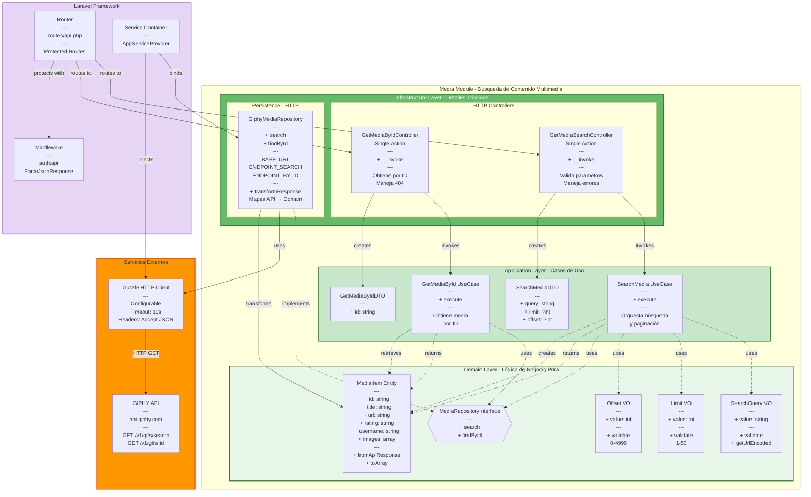

# Media Module - Diagrama de Componentes



## 📊 Descripción del Módulo Media

### Responsabilidades

- ✅ Búsqueda de contenido multimedia (GIFs)
- ✅ Integración con GIPHY API
- ✅ Paginación de resultados
- ✅ Obtención de media por ID
- ✅ Validación de parámetros de búsqueda
- ✅ Manejo de errores de API externa

### 🎯 Domain Layer (Núcleo del Negocio)

**Entidades:**
- `MediaItem` - Representa un item de media con sus metadatos
  - Construye desde respuesta API con `fromApiResponse()`
  - Convierte a array con `toArray()`

**Value Objects:**
- `SearchQuery` - Query de búsqueda (validado, URL encoded)
- `Limit` - Límite de resultados (1-50)
- `Offset` - Offset de paginación (0-4999)

**Interfaces (Puertos):**
- `MediaRepositoryInterface` - Contrato de búsqueda de media

**Reglas de Negocio:**
- Query es obligatorio
- Limit entre 1 y 50 (default: 25)
- Offset entre 0 y 4999 (default: 0)
- Rating por defecto: 'g' (general audiences)

### 🔄 Application Layer (Casos de Uso)

**Use Cases:**
1. `SearchMedia` - Busca media con paginación
   - Crea Value Objects
   - Invoca repositorio
   - Retorna array de `MediaItem`
   
2. `GetMediaById` - Obtiene media específico por ID
   - Valida ID
   - Retorna `MediaItem` o null

**DTOs:**
- `SearchMediaDTO` - Parámetros de búsqueda
- `GetMediaByIdDTO` - ID del media

**Flujo de Búsqueda:**
```
1. Controller valida request
2. Controller crea DTO
3. Use Case crea Value Objects
4. Use Case invoca Repository
5. Repository llama API externa
6. Repository transforma response
7. Repository retorna MediaItems
8. Controller retorna JSON
```

### 🔌 Infrastructure Layer (Adaptadores)

**HTTP Controllers (Single Action):**
- `GetMediaSearchController` - GET /api/v1/media/search
  - Validación: query (required), limit (1-50), offset (0-4999)
  - Maneja errores 422 (validación), 503 (API), 500 (server)
  
- `GetMediaByIdController` - GET /api/v1/media/{id}
  - Validación: id en ruta
  - Maneja 404 si no existe

**Repositorios (Adapters):**
- `GiphyMediaRepository` - Implementación HTTP con GIPHY
  - **Base URL**: `https://api.giphy.com`
  - **Endpoints**:
    - `/v1/gifs/search` - Búsqueda
    - `/v1/gifs/{id}` - Por ID
  - **Configuración**:
    - Timeout: 10 segundos
    - Headers: Accept JSON
    - API Key desde config
  - **Transformación**:
    - Valida `response_id` (detecta synthetic responses)
    - Mapea respuesta GIPHY → `MediaItem` (Domain)

### 🌐 Integración con GIPHY API

**Request Example:**
```http
GET /v1/gifs/search?api_key=xxx&q=cats&limit=25&offset=0&rating=g&lang=es
Host: api.giphy.com
Accept: application/json
```

**Response Structure:**
```json
{
  "data": [
    {
      "id": "abc123",
      "title": "Funny Cat GIF",
      "url": "https://giphy.com/gifs/abc123",
      "rating": "g",
      "username": "user",
      "images": {
        "original": { "url": "..." },
        "preview_gif": { "url": "..." }
      }
    }
  ],
  "pagination": {
    "total_count": 1000,
    "count": 25,
    "offset": 0
  },
  "meta": {
    "status": 200,
    "msg": "OK",
    "response_id": "unique_id"
  }
}
```

### 🔐 Seguridad

- ✅ Endpoints protegidos con `auth:api`
- ✅ API Key almacenada en `config/services.php`
- ✅ Validación estricta de parámetros
- ✅ Timeout para prevenir hanging requests

### ⚠️ Manejo de Errores

| Error | Status | Descripción |
|-------|--------|-------------|
| Validación | 422 | Parámetros inválidos |
| API Error | 503 | GIPHY API falló (RuntimeException) |
| Timeout | 503 | Conexión timeout |
| Synthetic Response | 503 | Response sin `response_id` |
| Server Error | 500 | Error inesperado |

### 📍 Endpoints

| Método | Ruta | Params | Auth |
|--------|------|--------|------|
| GET | /api/v1/media/search | query, limit?, offset? | Sí |
| GET | /api/v1/media/{id} | id | Sí |

**Query Parameters:**
- `query` - String (required, max 50 chars)
- `limit` - Integer (optional, 1-50, default 25)
- `offset` - Integer (optional, 0-4999, default 0)

### 🔗 Dependencias Externas

- **GIPHY API** - Proveedor de media (api.giphy.com)
- **Guzzle HTTP Client** - Cliente HTTP (v7+)
- **Config** - API Key en `services.giphy.api_key`

### 🧪 Testing

**Mocks en Tests:**
```php
$mock = new MockHandler([
    new Response(200, [], json_encode([...]))
]);
$client = new Client(['handler' => HandlerStack::create($mock)]);
```

**Test Coverage:**
- ✅ Búsqueda exitosa
- ✅ Paginación
- ✅ Búsqueda por ID
- ✅ Errores de validación
- ✅ Errores de API (500, timeout, synthetic)
- ✅ Usuario no autenticado (401)

### 📝 Principios Aplicados

✅ **Adapter Pattern** - GiphyRepository adapta API externa  
✅ **Value Objects** - Validación en constructores  
✅ **Fail Fast** - Validación temprana en VO  
✅ **Error Handling** - Try-catch en controller  
✅ **Transformation** - API response → Domain entity  

### 🔄 Extensibilidad

**Para agregar nuevo proveedor (ej: Tenor API):**
1. Crear `TenorMediaRepository` implements `MediaRepositoryInterface`
2. Registrar en `AppServiceProvider`
3. No tocar Domain ni Application
4. Switchear proveedor desde config

---

## 🔗 Diagramas de Secuencia Detallados

Para ver el flujo completo paso a paso de cada endpoint:

- **[Media Search Sequence Diagram](./Media_Search_Sequence.md)** 🔍 - Flujo completo de búsqueda con paginación
- **[Media Get By ID Sequence Diagram](./Media_GetById_Sequence.md)** 🎯 - Flujo de obtención por ID específico

Incluyen:
- ✅ Todos los pasos de autenticación y validación
- ✅ Casos de error detallados (422, 404, 503, 401)
- ✅ Ejemplos de requests/responses HTTP y SQL
- ✅ Métricas de performance
- ✅ Posibles mejoras (caché, validaciones)

---

**Última actualización**: 2026-03-20
