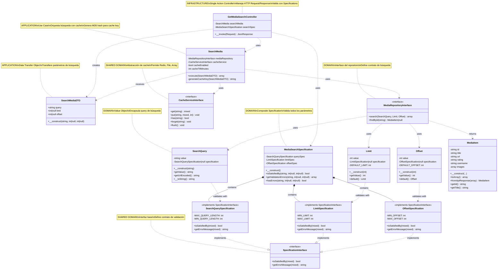

```mermaid
classDiagram
    %% ============================================
    %% INFRASTRUCTURE LAYER (Controller)
    %% ============================================
    class GetMediaSearchController {
        -SearchMedia searchMedia
        -MediaSearchSpecification searchSpec
        +__invoke(Request) JsonResponse
    }

    %% ============================================
    %% APPLICATION LAYER
    %% ============================================
    class SearchMedia {
        -MediaRepositoryInterface mediaRepository
        -CacheServiceInterface cacheService
        -bool cacheEnabled
        -int cacheTtlMinutes
        +execute(SearchMediaDTO) array
        -generateCacheKey(SearchMediaDTO) string
    }

    class SearchMediaDTO {
        +string query
        +int|null limit
        +int|null offset
        +__construct(string, int|null, int|null)
    }

    %% ============================================
    %% DOMAIN LAYER - Specifications
    %% ============================================
    class MediaSearchSpecification {
        -SearchQuerySpecification querySpec
        -LimitSpecification limitSpec
        -OffsetSpecification offsetSpec
        +__construct()
        +isSatisfiedBy(string, int|null, int|null) bool
        +getValidationErrors(string, int|null, int|null) array
        +hasErrors(string, int|null, int|null) bool
    }

    class SearchQuerySpecification {
        <<implements SpecificationInterface>>
        -MAX_QUERY_LENGTH: int
        -MIN_QUERY_LENGTH: int
        +isSatisfiedBy(mixed) bool
        +getErrorMessage(mixed) string
    }

    class LimitSpecification {
        <<implements SpecificationInterface>>
        -MIN_LIMIT: int
        -MAX_LIMIT: int
        +isSatisfiedBy(mixed) bool
        +getErrorMessage(mixed) string
    }

    class OffsetSpecification {
        <<implements SpecificationInterface>>
        -MIN_OFFSET: int
        -MAX_OFFSET: int
        +isSatisfiedBy(mixed) bool
        +getErrorMessage(mixed) string
    }

    class SpecificationInterface {
        <<interface>>
        +isSatisfiedBy(mixed) bool
        +getErrorMessage(mixed) string
    }

    %% ============================================
    %% DOMAIN LAYER - Value Objects
    %% ============================================
    class SearchQuery {
        -string value
        -SearchQuerySpecification|null specification
        +__construct(string)
        +getValue() string
        +getUrlEncoded() string
        +__toString() string
    }

    class Limit {
        -int value
        -LimitSpecification|null specification
        -DEFAULT_LIMIT: int
        +__construct(int)
        +getValue() int
        +default() Limit
    }

    class Offset {
        -int value
        -OffsetSpecification|null specification
        -DEFAULT_OFFSET: int
        +__construct(int)
        +getValue() int
        +default() Offset
    }

    %% ============================================
    %% DOMAIN LAYER - Repository & Services
    %% ============================================
    class MediaRepositoryInterface {
        <<interface>>
        +search(SearchQuery, Limit, Offset) array
        +findById(string) MediaItem|null
    }

    class CacheServiceInterface {
        <<interface>>
        +get(string) mixed
        +put(string, mixed, int) void
        +has(string) bool
        +forget(string) void
        +flush() void
    }

    %% ============================================
    %% DOMAIN LAYER - Entity
    %% ============================================
    class MediaItem {
        -string id
        -string title
        -string url
        -string rating
        -string username
        -array images
        +__construct(...)
        +toArray() array
        +fromApiResponse(array) MediaItem
        +getId() string
        +getTitle() string
    }

    %% ============================================
    %% RELATIONSHIPS
    %% ============================================
    
    %% Controller dependencies
    GetMediaSearchController ..> SearchMedia : uses
    GetMediaSearchController ..> MediaSearchSpecification : uses
    GetMediaSearchController ..> SearchMediaDTO : creates

    %% Use Case dependencies
    SearchMedia ..> MediaRepositoryInterface : uses
    SearchMedia ..> CacheServiceInterface : uses
    SearchMedia ..> SearchMediaDTO : receives

    %% Composite Specification
    MediaSearchSpecification *-- SearchQuerySpecification : contains
    MediaSearchSpecification *-- LimitSpecification : contains
    MediaSearchSpecification *-- OffsetSpecification : contains

    %% Specifications implement interface
    SearchQuerySpecification ..|> SpecificationInterface : implements
    LimitSpecification ..|> SpecificationInterface : implements
    OffsetSpecification ..|> SpecificationInterface : implements

    %% Value Objects use Specifications
    SearchQuery ..> SearchQuerySpecification : validates with
    Limit ..> LimitSpecification : validates with
    Offset ..> OffsetSpecification : validates with

    %% Repository uses Value Objects and returns Entity
    MediaRepositoryInterface ..> SearchQuery : uses
    MediaRepositoryInterface ..> Limit : uses
    MediaRepositoryInterface ..> Offset : uses
    MediaRepositoryInterface ..> MediaItem : returns

    %% Notas sobre capas
    note for GetMediaSearchController "INFRASTRUCTURE\nSingle Action Controller\nManeja HTTP Request/Response\nValida con Specifications"
    
    note for SearchMedia "APPLICATION\nUse Case\nOrquesta búsqueda con cache\nGenera MD5 hash para cache key"
    
    note for CacheServiceInterface "SHARED DOMAIN\nAbstracción de cache\nPermite Redis, File, Array"
    
    note for SearchMediaDTO "APPLICATION\nData Transfer Object\nTransfiere parámetros de búsqueda"
    
    note for MediaSearchSpecification "DOMAIN\nComposite Specification\nValida todos los parámetros"
    
    note for SpecificationInterface "SHARED DOMAIN\nInterfaz base\nDefine contrato de validación"
    
    note for SearchQuery "DOMAIN\nValue Object\nEncapsula query de búsqueda"
    
    note for MediaRepositoryInterface "DOMAIN\nInterface del repositorio\nDefine contrato de búsqueda"
```