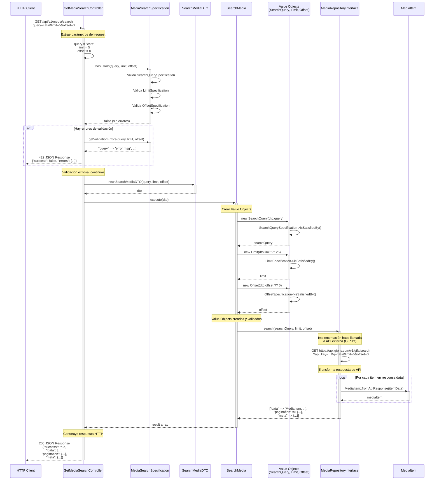

```mermaid
sequenceDiagram
    participant Client as HTTP Client
    participant Controller as GetMediaSearchController
    participant Spec as MediaSearchSpecification
    participant DTO as SearchMediaDTO
    participant UseCase as SearchMedia
    participant VOs as Value Objects<br/>(SearchQuery, Limit, Offset)
    participant Repo as MediaRepositoryInterface
    participant Entity as MediaItem

    %% === VALIDACIÓN ===
    Client->>+Controller: GET /api/v1/media/search<br/>query=cats&limit=5&offset=0
    
    Note over Controller: Extrae parámetros del request
    Controller->>Controller: query = "cats"<br/>limit = 5<br/>offset = 0
    
    Controller->>+Spec: hasErrors(query, limit, offset)
    Spec->>Spec: Valida SearchQuerySpecification
    Spec->>Spec: Valida LimitSpecification
    Spec->>Spec: Valida OffsetSpecification
    Spec-->>-Controller: false (sin errores)
    
    %% === CASO ALTERNATIVO: ERRORES ===
    alt Hay errores de validación
        Controller->>+Spec: getValidationErrors(query, limit, offset)
        Spec-->>-Controller: ["query" => "error msg", ...]
        Controller-->>Client: 422 JSON Response<br/>{"success": false, "errors": {...}}
    end
    
    %% === FLUJO PRINCIPAL ===
    Note over Controller: Validación exitosa, continuar
    
    Controller->>+DTO: new SearchMediaDTO(query, limit, offset)
    DTO-->>-Controller: dto
    
    Controller->>+UseCase: execute(dto)
    
    Note over UseCase: Crear Value Objects
    UseCase->>+VOs: new SearchQuery(dto.query)
    VOs->>VOs: SearchQuerySpecification->isSatisfiedBy()
    VOs-->>-UseCase: searchQuery
    
    UseCase->>+VOs: new Limit(dto.limit ?? 25)
    VOs->>VOs: LimitSpecification->isSatisfiedBy()
    VOs-->>-UseCase: limit
    
    UseCase->>+VOs: new Offset(dto.offset ?? 0)
    VOs->>VOs: OffsetSpecification->isSatisfiedBy()
    VOs-->>-UseCase: offset
    
    Note over UseCase: Value Objects creados y validados
    
    UseCase->>+Repo: search(searchQuery, limit, offset)
    
    Note over Repo: Implementación hace llamada<br/>a API externa (GIPHY)
    Repo->>Repo: GET https://api.giphy.com/v1/gifs/search<br/>?api_key=...&q=cats&limit=5&offset=0
    
    Note over Repo: Transforma respuesta de API
    
    loop Por cada item en response.data
        Repo->>+Entity: MediaItem::fromApiResponse(itemData)
        Entity-->>-Repo: mediaItem
    end
    
    Repo-->>-UseCase: ["data" => [MediaItem, ...],<br/>"pagination" => {...},<br/>"meta" => {...}]
    
    UseCase-->>-Controller: result array
    
    Note over Controller: Construye respuesta HTTP
    Controller-->>-Client: 200 JSON Response<br/>{"success": true,<br/>"data": [...],<br/>"pagination": {...},<br/>"meta": {...}}
```