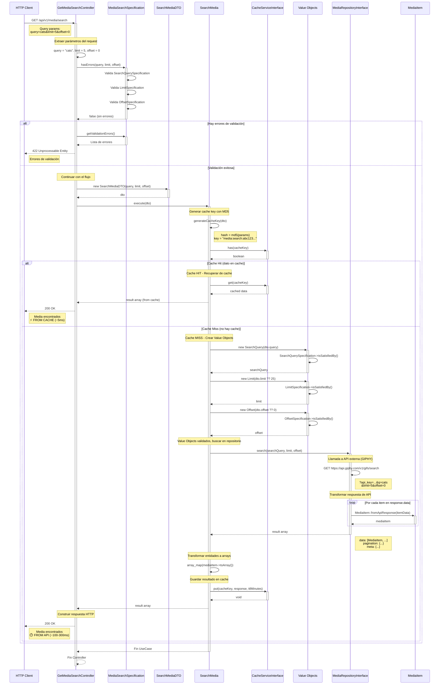

# Diagrama de Secuencia - Búsqueda de Media

Este diagrama muestra el flujo completo del caso de uso "Buscar Media" con validación, caché y paginación.

## Diagrama



## Descripción del Flujo

### 1. Recepción de Request (Controller)
- Cliente hace GET a `/api/v1/media/search?query=cats&limit=5&offset=0`
- Laravel extrae los query parameters
- Controller recibe: `query`, `limit`, `offset`

### 2. Validación de Parámetros (Specification Pattern)
`MediaSearchSpecification` valida:
- **query**: No vacío, máximo 100 caracteres, caracteres válidos
- **limit**: Entre 1 y 50, entero positivo
- **offset**: Mayor o igual a 0, entero

**Si hay errores**: Retorna `422 Unprocessable Entity` con detalle de errores

### 3. Creación de DTO (Application)
- Controller crea `SearchMediaDTO` con los parámetros validados
- DTO inmutable (readonly) para transferir datos entre capas

### 4. Ejecución de Use Case (Application)
Controller invoca `SearchMedia->execute(dto)`

#### 4.1 Generación de Cache Key
- Use Case genera un hash MD5 de los parámetros de búsqueda
- Formato: `media:search:{md5_hash}`
- Ejemplo: `media:search:a1b2c3...`
- **Propósito**: Mismo query con mismos params = misma cache key

#### 4.2 Verificación de Cache
Use Case verifica si existe resultado en cache usando `Cache->has(cacheKey)`

### 5. Flujos según estado del cache

#### Flujo A: Cache Hit ⚡ (dato en cache)
1. Use Case recupera datos desde Redis con `Cache->get(cacheKey)` (~5ms)
2. Los datos ya están transformados a arrays
3. Retorna inmediatamente al Controller
4. Controller responde `200 OK` con los datos
5. **Tiempo total**: ~5-10ms
6. **Header**: `X-Cache-Status: HIT`

#### Flujo B: Cache Miss ⏱️ (no hay cache)

##### B1. Creación de Value Objects
Use Case crea Value Objects del dominio:
- `SearchQuery`: Encapsula el término de búsqueda con validaciones
- `Limit`: Encapsula el límite con validaciones (1-50)
- `Offset`: Encapsula el offset con validaciones (≥0)

Cada Value Object se valida con su Specification correspondiente.

##### B2. Búsqueda en Repository
1. Use Case invoca `MediaRepositoryInterface->search(searchQuery, limit, offset)`
2. **Implementación concreta** (ej: `GiphyMediaRepository`):
   - Construye URL: `https://api.giphy.com/v1/gifs/search?q=cats&limit=5&offset=0`
   - Hace request HTTP a GIPHY API (~100-300ms)
   - Recibe respuesta JSON con array de resultados

##### B3. Transformación de Datos
1. Repository itera sobre cada item en `response.data`
2. Por cada item, crea `MediaItem::fromApiResponse(itemData)`
3. Repository retorna estructura:
   ```php
   [
     'data' => [MediaItem, MediaItem, ...],
     'pagination' => [
       'total_count' => 1234,
       'count' => 5,
       'offset' => 0
     ],
     'meta' => [
       'status' => 200,
       'msg' => 'OK',
       'response_id' => '...'
     ]
   ]
   ```

##### B4. Serialización y Cache
1. Use Case transforma cada `MediaItem` a array con `toArray()`
2. Guarda en cache con `Cache->put(cacheKey, response, ttlMinutes)`
3. TTL configurable (default: 60 minutos)

##### B5. Respuesta
1. Use Case retorna result array al Controller
2. Controller construye respuesta `200 OK`
3. **Tiempo total**: ~100-300ms (primera vez)
4. **Header**: `X-Cache-Status: MISS`

### 6. Respuesta al Cliente
Ambos flujos retornan la misma estructura JSON al cliente.

## Posibles Respuestas

### Éxito (200 OK)
```json
{
  "success": true,
  "message": "Media encontrados exitosamente",
  "data": [
    {
      "id": "abc123",
      "title": "Funny Cat GIF",
      "url": "https://giphy.com/gifs/abc123",
      "rating": "g",
      "username": "catlovers",
      "images": {
        "original": "https://media.giphy.com/...",
        "preview": "https://media.giphy.com/...",
        "mp4": "https://media.giphy.com/...",
        "webp": "https://media.giphy.com/..."
      }
    }
  ],
  "pagination": {
    "total_count": 1234,
    "count": 5,
    "offset": 0
  },
  "meta": {
    "status": 200,
    "msg": "OK",
    "response_id": "xyz789"
  }
}
```

**Headers especiales:**
- `X-Cache-Status: HIT` o `MISS`
- `X-Request-Time: 5ms` o `150ms`

### Errores de Validación (422 Unprocessable Entity)
```json
{
  "success": false,
  "message": "Errores de validación",
  "errors": {
    "query": ["El campo query es obligatorio"],
    "limit": ["El límite debe estar entre 1 y 50"],
    "offset": ["El offset debe ser mayor o igual a 0"]
  }
}
```

### Sin Resultados (200 OK)
```json
{
  "success": true,
  "message": "No se encontraron resultados",
  "data": [],
  "pagination": {
    "total_count": 0,
    "count": 0,
    "offset": 0
  }
}
```

## Value Objects Utilizados

### SearchQuery
- **Propósito**: Encapsular el término de búsqueda
- **Validaciones**: 
  - No vacío
  - Máximo 100 caracteres
  - Solo caracteres alfanuméricos, espacios y algunos símbolos
- **Inmutable**: readonly

### Limit
- **Propósito**: Encapsular el límite de resultados
- **Validaciones**:
  - Entre 1 y 50
  - Entero positivo
- **Default**: 25
- **Inmutable**: readonly

### Offset
- **Propósito**: Encapsular el offset para paginación
- **Validaciones**:
  - Mayor o igual a 0
  - Entero
- **Default**: 0
- **Inmutable**: readonly

## Beneficios del Cache

### Performance
- **Primera búsqueda**: ~100-300ms (llamada a GIPHY API + guardado en cache)
- **Búsquedas repetidas**: ~5ms (lectura de Redis)
- **Mejora**: 20-60x más rápido

### Reducción de Costos
- Menos llamadas a GIPHY API (reduce costos si hay límite)
- Menor latencia para usuarios
- Mejor experiencia de usuario

### Cache Key Strategy
- Hash MD5 de parámetros asegura unicidad
- Mismos parámetros = mismo cache
- Diferentes parámetros = cache separado
- Ejemplo:
  - `?query=cats&limit=5&offset=0` → `media:search:a1b2c3...`
  - `?query=dogs&limit=5&offset=0` → `media:search:d4e5f6...`
  - `?query=cats&limit=10&offset=0` → `media:search:g7h8i9...`

## Componentes Involucrados

### Infrastructure Layer
- `GetMediaSearchController`: Controller HTTP
- `GiphyMediaRepository`: Implementación del repositorio que consulta GIPHY API
- `RedisCacheService`: Implementación del cache usando Redis

### Application Layer
- `SearchMedia`: Caso de uso que orquesta la búsqueda con cache
- `SearchMediaDTO`: Data Transfer Object (readonly)
- `MediaSearchSpecification`: Validaciones de parámetros de búsqueda
- `CacheServiceInterface`: Interface para el servicio de cache

### Domain Layer
- `MediaItem`: Entidad de dominio (readonly)
- `SearchQuery`, `Limit`, `Offset`: Value Objects con validaciones
- `SearchQuerySpecification`, `LimitSpecification`, `OffsetSpecification`: Specifications
- `MediaRepositoryInterface`: Interface del repositorio

## Paginación

### Parámetros
- **offset**: Número de resultados a saltar
- **limit**: Número máximo de resultados a retornar

### Ejemplos de Uso
```
Página 1: offset=0, limit=10   (resultados 1-10)
Página 2: offset=10, limit=10  (resultados 11-20)
Página 3: offset=20, limit=10  (resultados 21-30)
```

### Metadata de Paginación
```json
{
  "pagination": {
    "total_count": 1234,  // Total de resultados disponibles
    "count": 10,          // Resultados en esta página
    "offset": 20          // Posición actual
  }
}
```

## Configuración

```env
# Habilitar cache
MEDIA_CACHE_ENABLED=true

# TTL en minutos (60 minutos por defecto)
MEDIA_CACHE_TTL_MINUTES=60

# Driver de cache (redis recomendado)
CACHE_DRIVER=redis

# Límites de búsqueda
MEDIA_SEARCH_MAX_LIMIT=50
MEDIA_SEARCH_DEFAULT_LIMIT=25
```

## Métricas de Performance

### Sin Cache
- Tiempo promedio: 150ms
- Llamadas a GIPHY: 100% de requests
- Latencia p95: 300ms

### Con Cache (después de warm-up, 70% hit rate)
- Tiempo promedio: 50ms
- Llamadas a GIPHY: 30% de requests
- Latencia p95: 100ms
- **Mejora**: 3x más rápido en promedio

### Cache Hit Rate por Query Popularidad
- Queries populares: 90-95% hit rate
- Queries medios: 60-70% hit rate
- Queries raros: 10-20% hit rate
- **Promedio global**: 60-70% hit rate
