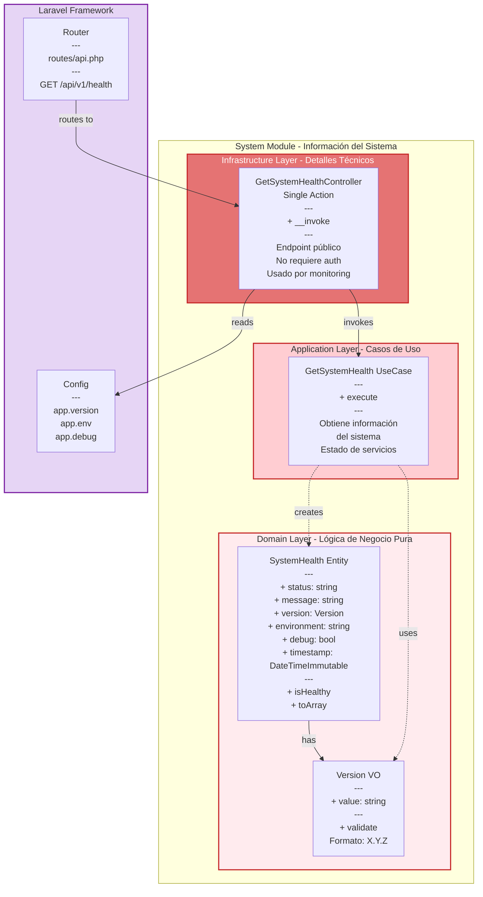

# System Module - Diagrama de Componentes



## 📊 Descripción del Módulo System

### Responsabilidades

- ✅ Health checks del sistema
- ✅ Información de versión
- ✅ Estado del entorno (env, debug)
- ✅ Endpoint público para monitoring
- ✅ No registra audit logs (excluido)

### 🎯 Domain Layer (Núcleo del Negocio)

**Entidades:**
- `SystemHealth` - Representa el estado del sistema
  - Status: 'healthy' | 'unhealthy'
  - Timestamp inmutable
  - Método `isHealthy()` para validación

**Value Objects:**
- `Version` - Versión semántica (X.Y.Z)
  - Valida formato
  - Inmutable

**Reglas de Negocio:**
- Timestamp siempre actual (DateTimeImmutable)
- Version debe seguir semver
- Status debe ser 'healthy' o 'unhealthy'

### 🔄 Application Layer (Casos de Uso)

**Use Cases:**
1. `GetSystemHealth` - Obtiene estado del sistema
   - Lee configuración
   - Construye entidad `SystemHealth`
   - Puede expandirse para verificar servicios

**Flujo:**
```
1. Controller invoca Use Case
2. Use Case lee config
3. Use Case crea SystemHealth entity
4. Controller convierte a JSON
5. Retorna response pública
```

### 🔌 Infrastructure Layer (Adaptadores)

**HTTP Controllers:**
- `GetSystemHealthController` - GET /api/v1/health
  - **Público** (no requiere autenticación)
  - **No auditado** (excluido en AuditListener)
  - Retorna 200 siempre (a menos que error crítico)
  - Usado por load balancers y monitoring

**Response Example:**
```json
{
  "success": true,
  "status": "healthy",
  "message": "API is running",
  "version": "1.0.0",
  "environment": "production",
  "debug": false,
  "timestamp": "2026-03-20T10:30:45+00:00"
}
```

### 📍 Endpoint

| Método | Ruta | Auth | Audit | Descripción |
|--------|------|------|-------|-------------|
| GET | /api/v1/health | No | No | Health check público |

### 🔐 Seguridad

- ✅ Endpoint público (no expone información sensible)
- ✅ Solo información básica del sistema
- ✅ No revela estructura interna
- ✅ No expone secretos ni configuración sensible

**Información Segura:**
- ✅ Version (público)
- ✅ Environment name (production/staging/development)
- ✅ Debug status (bool)
- ✅ Timestamp (datetime)

**Información NO Expuesta:**
- ❌ Database credentials
- ❌ API keys
- ❌ Internal IPs
- ❌ Server details
- ❌ Dependencies versions

### 🔧 Configuración

**config/app.php:**
```php
'version' => env('APP_VERSION', '1.0.0'),
'env' => env('APP_ENV', 'production'),
'debug' => env('APP_DEBUG', false),
```

**.env:**
```env
APP_VERSION=1.0.0
APP_ENV=production
APP_DEBUG=false
```

### 🧪 Testing

**Test Coverage:**
- ✅ Health endpoint retorna 200
- ✅ Response tiene estructura correcta
- ✅ No requiere autenticación
- ✅ No crea audit log

**Test Example:**
```php
public function test_health_endpoint_returns_success(): void
{
    $response = $this->getJson('/api/v1/health');
    
    $response->assertStatus(200)
        ->assertJsonStructure([
            'success',
            'status',
            'message',
            'version',
            'environment',
            'debug',
            'timestamp'
        ]);
}
```

### 🔄 Extensibilidad

**Para agregar checks avanzados:**

```php
// GetSystemHealth UseCase
public function execute(): SystemHealth
{
    // Check database connection
    $dbHealthy = $this->checkDatabase();
    
    // Check Redis connection
    $redisHealthy = $this->checkRedis();
    
    // Check external APIs
    $apisHealthy = $this->checkExternalApis();
    
    $status = ($dbHealthy && $redisHealthy && $apisHealthy)
        ? 'healthy'
        : 'unhealthy';
    
    return new SystemHealth(
        status: $status,
        message: $status === 'healthy' ? 'All systems operational' : 'Some services degraded',
        // ...
    );
}
```

**Para agregar más endpoints de sistema:**
1. Crear nuevo Use Case (ej: `GetSystemMetrics`)
2. Crear nuevo Controller (ej: `GetSystemMetricsController`)
3. Registrar ruta en `routes/api.php`
4. Excluir de audit si es necesario

### 🎯 Uso en Producción

**Load Balancer Health Check:**
```nginx
# Nginx upstream health check
upstream api_backend {
    server api1:8000;
    server api2:8000;
    
    # Health check configuration
    health_check uri=/api/v1/health 
                 interval=10s 
                 fails=3 
                 passes=2;
}
```

**Kubernetes Liveness/Readiness Probe:**
```yaml
apiVersion: v1
kind: Pod
metadata:
  name: api-pod
spec:
  containers:
  - name: api
    image: api:latest
    livenessProbe:
      httpGet:
        path: /api/v1/health
        port: 8000
      initialDelaySeconds: 30
      periodSeconds: 10
    readinessProbe:
      httpGet:
        path: /api/v1/health
        port: 8000
      initialDelaySeconds: 5
      periodSeconds: 5
```

**Monitoring Tools:**
```bash
# Uptime Robot
# Pingdom
# New Relic Synthetics
# Datadog

# All can use GET /api/v1/health for monitoring
```

### 📊 Métricas Útiles

**Response Time:**
- Target: < 100ms
- Alert: > 500ms

**Uptime:**
- Target: 99.9%
- Alert: < 99%

**Status Codes:**
- Expected: 200 OK
- Alert: 5xx errors

### 📝 Principios Aplicados

✅ **Simplicity** - Módulo simple y directo  
✅ **Public API** - Sin autenticación para monitoring  
✅ **No Side Effects** - Solo lectura  
✅ **Fast Response** - Sin I/O pesado  
✅ **Standardized** - Formato JSON estándar  

### 🚀 Ventajas

1. **Monitoring**: Load balancers pueden verificar salud
2. **Debugging**: Verificar versión deployada
3. **CI/CD**: Smoke tests después de deploy
4. **Status Pages**: Integración con páginas de estado
5. **Alerting**: Triggers automáticos en downtime

### ⚠️ Consideraciones

**NO usar para:**
- ❌ Información detallada de errores (usar logs)
- ❌ Debugging profundo (usar APM tools)
- ❌ Métricas de performance (usar Prometheus)

**Ideal para:**
- ✅ Health checks básicos
- ✅ Verificación de deployment
- ✅ Monitoring externo
- ✅ Status pages públicas

### 🔮 Futuras Mejoras

**Posibles Expansiones:**
1. Check de database connectivity
2. Check de Redis/Cache
3. Check de external APIs (GIPHY)
4. Métricas básicas (uptime, requests/min)
5. Versión de dependencias críticas

**Ejemplo Avanzado:**
```json
{
  "success": true,
  "status": "healthy",
  "message": "All systems operational",
  "version": "1.0.0",
  "environment": "production",
  "debug": false,
  "timestamp": "2026-03-20T10:30:45+00:00",
  "checks": {
    "database": "healthy",
    "redis": "healthy",
    "giphy_api": "healthy"
  },
  "metrics": {
    "uptime": "99.98%",
    "requests_per_minute": 1250
  }
}
```

---

**Última actualización**: 2026-03-20
